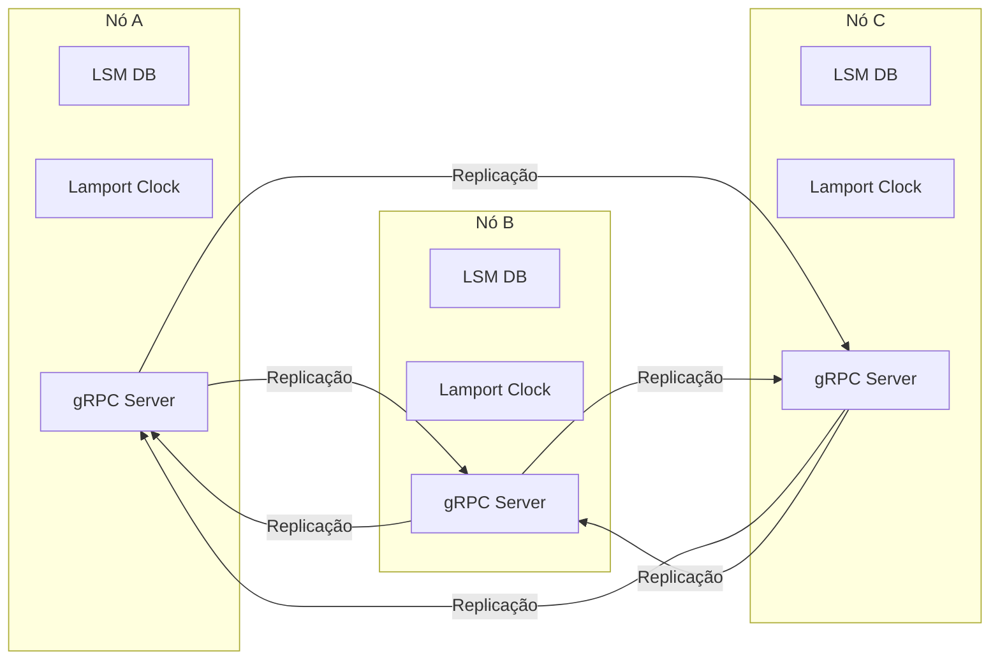
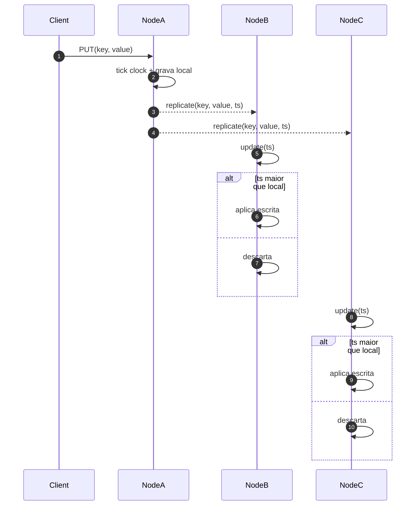

# py_distributed_database

Este projeto demonstra uma implementação didática de um banco de dados distribuído escrito em Python. Cada nó utiliza uma LSM Tree para armazenamento local e replica suas operações para os pares via gRPC. O protocolo de replicação segue o modelo **multi‑líder all‑to‑all** com resolução de conflitos baseada em **Last Write Wins (LWW)** usando relógios de **Lamport**.

## Visão geral da arquitetura



Cada instância contém seu próprio clock lógico e armazena `(valor, timestamp)`. Ao receber uma atualização de outro nó, compara os timestamps: se o recebido for maior, a escrita substitui a local; caso contrário, é descartada.

## Fluxo de escrita



A mesma regra vale para deleções, que são propagadas como *tombstones*. Isso garante **convergência eventual** de todos os nós.

## Idempotência e prevenção de duplicatas

Cada escrita replicada possui um identificador único `op_id` no formato `"<node>:<seq>"`.
Os nós mantêm um **vetor de versões** (`last_seen`) com o maior contador aplicado de cada origem.
Quando uma atualização chega:

1. Extrai-se a origem e o contador do `op_id`.
2. Se o contador é maior que `last_seen[origem]`, a operação é aplicada e o valor é atualizado.
3. Caso contrário, ela é ignorada, garantindo **idempotência**.

Operações originadas localmente são armazenadas em um **log de replicação** até que todos os pares as recebam.
Se um nó ficar offline, ele pode recuperar as mudanças perdidas ao reprovar o log quando voltar.

## Principais componentes

- **Write-Ahead Log (WAL)** – registra cada operação antes que seja aplicada, garantindo durabilidade.
- **MemTable** – estrutura em memória (Árvore Rubro-Negra) para escritas rápidas.
- **SSTables** – arquivos imutáveis que armazenam os dados permanentemente.
- **Compactação** – remove registros obsoletos ao mesclar SSTables.
- **Lamport Clock** – contador lógico usado para ordenar operações entre nós.
- **Replicação multi-líder** – qualquer nó pode aceitar escritas e replicá-las para todos os outros de forma assíncrona.
- **Driver opcional** – encaminha requisições para garantir "read your own writes".
- **Log de replicação** – armazena operações geradas localmente até que todos os pares confirmem o recebimento.
- **Vetor de versões** – cada nó mantém `last_seen` (origem → último contador) para aplicar cada operação exatamente uma vez.

## Executando

1. Instale as dependências
   ```bash
   pip install -r requirements.txt
   ```
2. Inicie o exemplo
   ```bash
   python main.py
   ```
   O script cria um cluster local com múltiplos nós e replica as operações entre eles.

Para consistência por usuário, utilize o `Driver`:

```python
from replication import NodeCluster
from driver import Driver

cluster = NodeCluster(num_nodes=2)
driver = Driver(cluster)
driver.put("alice", "k", "v")
value = driver.get("alice", "k")
cluster.shutdown()
```

## Testes

Execute a bateria de testes para validar o sistema:
```bash
python -m unittest discover -s tests -v
```

## Estrutura de arquivos

- `main.py` – exemplo de inicialização do cluster.
- `lsm_db.py`, `mem_table.py`, `wal.py`, `sstable.py` – implementação da LSM Tree.
- `replication.py` e `replica/` – lógica de replicação gRPC e serviços.
- `tests/` – casos de teste.
