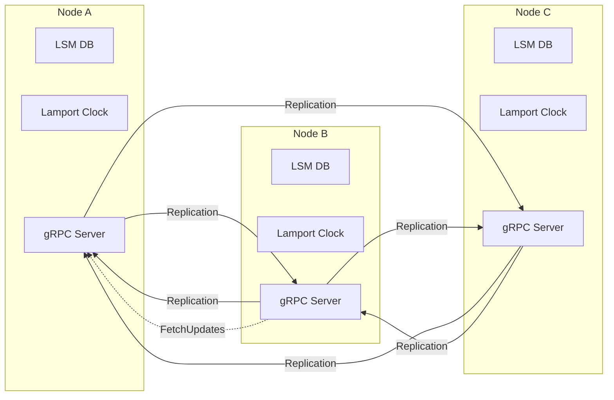
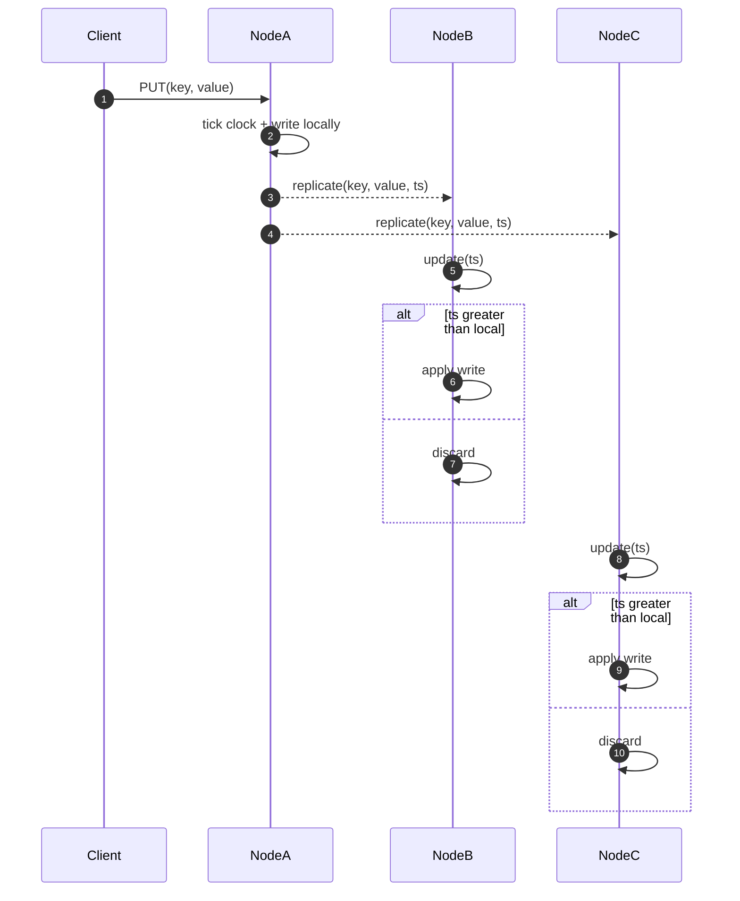
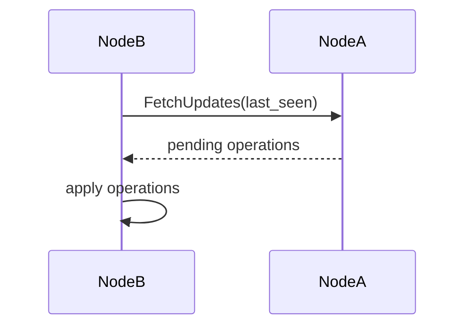
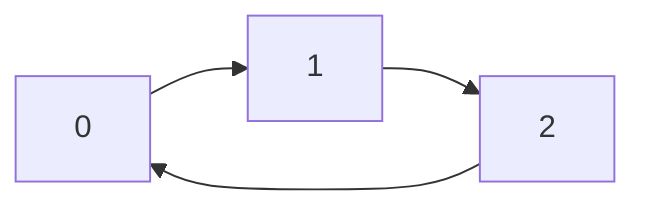
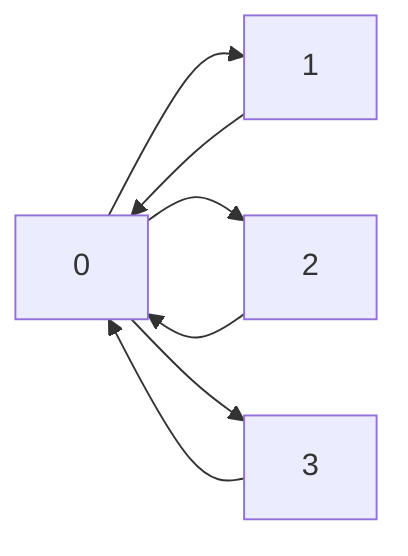
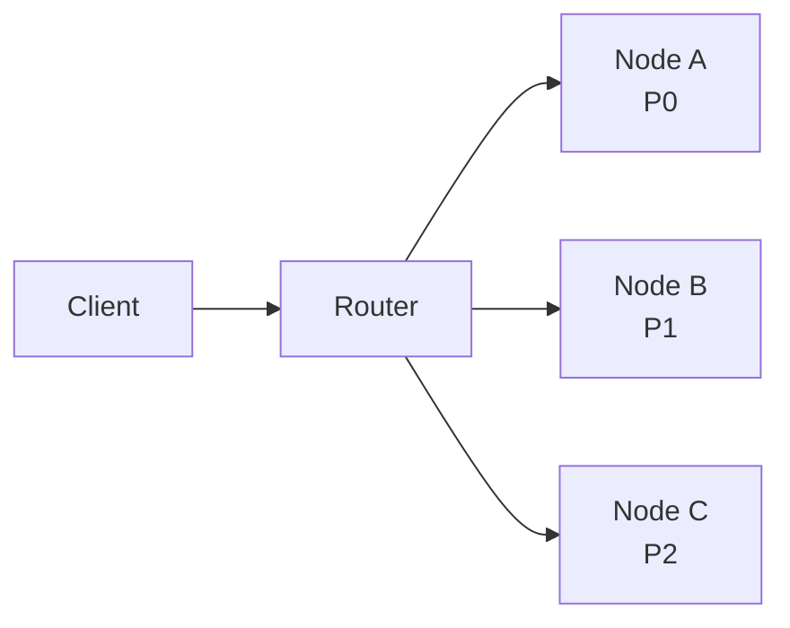

# py_distributed_database

This project showcases a didactic implementation of a distributed database written in Python. Each node stores data locally using an LSM Tree and replicates updates to its peers via gRPC. Replication follows a **multi‑leader all‑to‑all** model with conflict resolution based on **Last Write Wins (LWW)** using **Lamport clocks**.

## Architecture overview



Each instance keeps its own logical clock and stores `(value, timestamp)`. When an update arrives from another node its timestamp is compared with the local one: if newer, it overwrites the current value; otherwise it is discarded.

## Write flow



The same rule applies to deletions which propagate as *tombstones*, ensuring **eventual convergence** of all replicas.

## Idempotency and duplicate prevention

Every replicated write carries a unique identifier `op_id` in the format `"<node>:<seq>"`. Nodes keep a **version vector** (`last_seen`) with the highest counter applied from each source. When an update arrives:

1. The origin and counter are extracted from `op_id`.
2. If the counter is greater than `last_seen[origin]` the operation is applied and the value updated.
3. Otherwise it is ignored, guaranteeing **idempotency**.

Operations generated locally are stored in a **replication log** until all peers acknowledge them. If a node goes offline it can recover lost updates by replaying this log when it comes back.

## Main components

- **Write-Ahead Log (WAL)** – records each operation before applying it, ensuring durability.
- **MemTable** – in-memory (Red‑Black Tree) structure for fast writes.
- **SSTables** – immutable files storing data permanently.
- **Compaction** – removes obsolete records by merging SSTables.
- **Lamport Clock** – logical counter used to order operations across nodes.
- **Multi-leader replication** – any node can accept writes and asynchronously replicate them.
- **Optional Driver** – client aware of the topology that keeps a partition map cache.
- **Optional LRU cache** – each node can store recent reads by setting `cache_size` in `NodeServer`.
- **Optional secondary indexes** – set `index_fields` in `NodeServer` to keep simple in-memory indexes.
- **Optional global indexes** – set `global_index_fields` in `NodeServer` or `NodeCluster` to rebuild global indexes on startup.
- **Replication log** – stores locally generated operations until all peers confirm receipt.
- **Version vector** – each node maintains `last_seen` (origin → last counter) to apply every operation exactly once.
- **Heartbeat** – `Ping` service that monitors peer availability.
- **Sloppy quorum** – uses extra healthy nodes when the original owners are offline.
- **Hinted handoff** – writes destined for unavailable nodes are stored on substitutes and resent in the background.
- **Read repair** – outdated replicas are updated asynchronously during reads.

## Offline sync and anti-entropy

To tolerate temporary node failures the system offers a **pull** synchronization. When restarting, a node issues the `FetchUpdates` RPC sending its `last_seen` vector and receives the missing operations. A background process repeats this periodically (anti‑entropy) ensuring replicas eventually converge.



- The replication log is persisted in `replication_log.json` and resent in batches.
- If a destination is unreachable another healthy node keeps the update with `hinted_for` and delivers it once the peer recovers (hinted handoff).
- **Merkle tree** hashes allow skipping already synchronized data when exchanging updates, sending only divergent keys. This runs periodically as anti‑entropy.

## Running

1. Install the dependencies (including `grpcio` and `protobuf` for gRPC communication)
   ```bash
   pip install -r requirements.txt
   ```
2. Start the example
   ```bash
   python main.py
   ```
   The script creates a local cluster with multiple nodes and replicates operations between them.

### FastAPI server

`main.py` runs a small FastAPI application. Launch it with

```bash
python main.py
# or: python -m api.main
# or: uvicorn api.main:app --reload
```
This automatically starts a `NodeCluster` during the startup event so the HTTP endpoints are backed by a live cluster.

For per-user consistency use the `Driver`:

```python
from replication import NodeCluster
from driver import Driver

cluster = NodeCluster(num_nodes=2)
driver = Driver(cluster)
driver.put("alice", "k", "1", "v")
value = driver.get("alice", "k", "1")
cluster.shutdown()
```

### Data CRUD API

The REST server offers simple endpoints to manage data stored in the cluster.

| Method | Path | Description |
| ------ | ---- | ----------- |
| `GET` | `/data/records` | List all records in the cluster |
| `POST` | `/data/records` | Insert a new record using a JSON body |
| `PUT` | `/data/records/{partition_key}/{clustering_key}` | Update an existing record (send `value` as query param) |
| `DELETE` | `/data/records/{partition_key}/{clustering_key}` | Remove a record |
| `GET` | `/data/records/scan_range` | Retrieve items for a partition between two clustering keys |
| `GET` | `/data/query_index` | Retrieve keys from a secondary index |

Example usage with `curl`:

```bash
curl -X POST http://localhost:8000/data/records \
     -H "Content-Type: application/json" \
     -d '{"partitionKey":"alpha","clusteringKey":"a","value":"v1"}'

curl http://localhost:8000/data/records

curl -X PUT "http://localhost:8000/data/records/alpha/a?value=v2"

curl -X DELETE http://localhost:8000/data/records/alpha/a

curl "http://localhost:8000/data/query_index?field=color&value=red"
# {"keys": ["p1"]}
```

### Cluster actions API

The API also exposes maintenance operations to manage the cluster:

| Method | Path | Description |
| ------ | ---- | ----------- |
| `POST` | `/cluster/actions/check_hot_partitions` | Split partitions with heavy traffic |
| `POST` | `/cluster/actions/reset_metrics` | Reset hotspot counters |
| `POST` | `/cluster/actions/mark_hot_key` | Enable salting for a hot key |
| `POST` | `/cluster/actions/split_partition` | Manually divide a partition |
| `POST` | `/cluster/actions/merge_partitions` | Merge two adjacent partitions |
| `POST` | `/cluster/actions/rebalance` | Evenly redistribute partitions |

`split_partition` expects `pid` (partition id) and an optional `split_key` that
defines the new boundary. `merge_partitions` receives `pid1` and `pid2` for the
two consecutive partitions to be joined.

Example:

```bash
curl -X POST "http://localhost:8000/cluster/actions/reset_metrics"
curl -X POST "http://localhost:8000/cluster/actions/check_hot_partitions"
curl -X POST "http://localhost:8000/cluster/actions/mark_hot_key?key=hot&buckets=4"
curl -X POST "http://localhost:8000/cluster/actions/split_partition?pid=0&split_key=g"
curl -X POST "http://localhost:8000/cluster/actions/merge_partitions?pid1=0&pid2=1"
curl -X POST "http://localhost:8000/cluster/actions/rebalance"
```

The management dashboard under `app/` exposes buttons for these split and merge
operations alongside other cluster tasks.

### Topology aware driver

The driver keeps a local cache of the partition map obtained with `get_partition_map()`. Requests go directly to the responsible node. If a `NotOwner` error is returned (for example after a partition migration) the driver refreshes the cache and retries.

## Replication topology

`NodeCluster` has an optional `topology` parameter defining which nodes replicate to each other. When omitted the cluster forms a full mesh (all-to-all). The dictionary uses the node index as the key and a list of destinations as the value.

The cluster also uses a `ConsistentHashRing` to determine which nodes own each key. The `replication_factor` parameter indicates how many replicas should store the same value:

```python
from replication import NodeCluster

cluster = NodeCluster(
    "/tmp/quorum", num_nodes=3,
    replication_factor=3,
    write_quorum=2,  # W
    read_quorum=2,   # R
)
```

Lower values of `W` and `R` increase availability because fewer nodes must be online, while higher quorums improve consistency at the cost of requiring more active replicas.

## Virtual partitions (vnodes)

Using the hash ring enables the `ConsistentHashPartitioner`. Each server receives several virtual tokens randomly distributed in the 160-bit space. Set `partitions_per_node` to indicate how many tokens each node will hold. Total partitions become `num_nodes * partitions_per_node`, allowing finer balance and smooth redistribution when `add_node()` or `remove_node()` are executed.

```python
from replication import NodeCluster

cluster = NodeCluster(
    "/tmp/vnodes",
    num_nodes=3,
    partition_strategy="hash",
    partitions_per_node=64,
)
```

The `UpdateHashRing` RPC propagates new tokens whenever the ring changes.

### Ring topology

```python
from replication import NodeCluster

ring = {
    0: [1],
    1: [2],
    2: [0],
}
cluster = NodeCluster("/tmp/ring", num_nodes=3, topology=ring)
```



### Star topology

```python
from replication import NodeCluster

star = {
    0: [1, 2, 3],
    1: [0],
    2: [0],
    3: [0],
}
cluster = NodeCluster("/tmp/star", num_nodes=4, topology=star)
```



## Sloppy Quorum and Hinted Handoff

Each node monitors peer availability through a heartbeat service. If a node responsible for a given key is offline the write is not rejected: other healthy nodes are selected to complete the quorum (**sloppy quorum**). The operation is sent to the substitute with the field `hinted_for` indicating the original destination.

These updates are recorded in `hints.json` and a background thread periodically checks if the peer is back online. When it is, the data is transferred and the hint removed.

The same principle applies to reads: if the preferred replicas are unavailable the cluster contacts additional nodes until `R` responses are gathered. During this read, values are compared and outdated replicas are updated asynchronously (read repair).

## Vector Clocks, CRDTs and consistency modes

Besides the default **LWW**, the system supports concurrency control using **Vector Clocks** and **CRDT** structures. The `consistency_mode` parameter sets the algorithm used by each node:

- `"lww"` – Last Write Wins with Lamport clocks (default)
- `"vector"` – version vectors to detect conflicts
- `"crdt"` – replicates serialized state of configured CRDTs

### CRDT counter example

To manipulate a grow-only counter (`GCounter`) create nodes manually with `consistency_mode="crdt"` and a `crdt_config` mapping:

```python
from tempfile import TemporaryDirectory
from replica.grpc_server import NodeServer

cfg = {"c": "gcounter"}

with TemporaryDirectory() as dir_a, TemporaryDirectory() as dir_b:
    node_a = NodeServer(dir_a, node_id="A", peers=[("localhost", 8001, "B")],
                        consistency_mode="crdt", crdt_config=cfg)
    node_b = NodeServer(dir_b, node_id="B", peers=[("localhost", 8000, "A")],
                        consistency_mode="crdt", crdt_config=cfg)
    node_a.start(); node_b.start()

    node_a.apply_crdt("c", 1)
    node_b.apply_crdt("c", 2)

    print(node_a.crdts["c"].value)  # 3
    print(node_b.crdts["c"].value)  # 3

    node_a.stop(); node_b.stop()
```

## Composite keys

Keys may have two components: the **partition key** and the **clustering key**. The function `compose_key(partition_key, clustering_key)` generates the unified representation `"partition|cluster"`. In hash partitioning only the partition key is used in the hash, so all records with the same prefix stay in the same partition regardless of the clustering component.

## Secondary indexes

Enable in-memory secondary indexes by creating the `NodeServer` with the `index_fields` option:

```python
from replica.grpc_server import NodeServer

node = NodeServer('/tmp/db', index_fields=['name'])
```

At startup the server automatically rebuilds the indexes by reading existing data. `Put` and `Delete` operations keep them updated. Queries can be executed through `query_index()`.

## Sharding and Routing

The cluster supports both range-based partitions and hash-based partitions.

### Partitioning strategies

- **Ranges** – set `partition_strategy='range'` and pass `key_ranges`.
- **Hash** – set `partition_strategy='hash'` and optionally `num_partitions`.

### Routing

1. With `enable_forwarding=True` the receiving node forwards requests to the partition owner.
2. A dedicated router can use `get_partition_map()` to choose the destination.
3. The `Driver` inside each client keeps the map and updates it after a `NotOwner` response.

Whenever the mapping changes call `cluster.update_partition_map()` to send the new table to replicas and update caches.



## Key range partitioning

Keys can also be distributed manually by range, associating each partition with a specific node using the `key_ranges` parameter.

## Key hash partitioning

Keys may be distributed automatically via `hash(key) % num_partitions`. If `num_partitions` is omitted the cluster creates 128 logical ranges by default.

## Random prefixing / Salting

Hot keys can be spread across partitions by enabling salting which adds a random prefix before the partition key. Reads probe all salted variants and return the latest value.

### Dynamic salting of hot keys

Call `mark_hot_key(key, buckets, migrate=True)` to dynamically distribute new writes among `buckets` prefixes and optionally migrate the current value to each variant.

## Hotspot metrics

`NodeCluster` maintains operation counters per partition (`partition_ops`) and per key (`key_freq`). Use `reset_metrics()` to reset counters and `get_hot_partitions()` / `get_hot_keys()` to inspect hotspots.

## Read balancing

Set `load_balance_reads=True` when creating the cluster (or the driver) to distribute reads among replicas.

## Partition splitting

Use `split_partition(pid, split_key=None)` to manually divide a busy range. The cluster can also monitor metrics and automatically split hot partitions by calling `check_hot_partitions()`.

### Automatic hotspot repartitioning

`get_partition_stats()` provides the amount of operations executed in each partition. Combine it with `check_hot_partitions()` to automatically split heavy regions.

## Adding and removing nodes

Use `add_node()` to include a new server in the cluster. Partitions are redistributed and existing records copied to the new node. To remove a machine call `remove_node(node_id)` which transfers its data before shutting it down. After any redistribution call `cluster.update_partition_map()` so all replicas receive the new mapping via the RPCs `UpdatePartitionMap` and `UpdateHashRing`.

## Stage 6 – Request Routing

The cluster can forward each request to the correct partition owner in different ways.

### Coordinator node (forwarding)

A client may contact any node in the cluster. If the server that received the request is not the owner it will automatically forward the operation and return the result when `enable_forwarding=True`.

### Dedicated router

A separate service can know the partition map and simply relay operations to the correct nodes.

### Topology aware client

The `Driver` caches the partition map and updates it whenever a `NotOwner` error is received. It can also balance reads across replicas by setting `load_balance_reads`.

### Mapping update

If a partition is split or the cluster is rebalanced call `cluster.update_partition_map()` to distribute the new mapping to all replicas. The method returns the dictionary so drivers or routers can update their cache.

### Automatic partition map updates

The `Driver` registers with the cluster and receives updates whenever `update_partition_map()` is executed, allowing all connected drivers to refresh automatically.

### Read cache

Set `cache_size` when creating each `NodeServer` to enable an LRU read cache. Use `cache_size=0` (default) to disable the feature.

### Stage tests

Run only the routing and driver tests:

```bash
python -m unittest tests/test_routing.py tests/test_smart_driver.py -v
```

## Dedicated Routing Tier

A standalone gRPC router can relay all client requests to the correct node. Start it by passing `start_router=True` when creating the cluster and connect using `GRPCRouterClient`.

```python
from replication import NodeCluster
from replica.client import GRPCRouterClient

cluster = NodeCluster('/tmp/router_cluster', num_nodes=3,
                      partition_strategy='hash',
                      start_router=True, router_port=7000)

router = GRPCRouterClient('localhost', 7000)
router.put('rkey', 'v1')
print(router.get('rkey'))

# rebalance or split partitions and propagate the new mapping
import replica.replication_pb2 as pb
new_map = cluster.update_partition_map()
router.stub.UpdatePartitionMap(pb.PartitionMap(items=new_map))
```

This mode centralizes request routing but adds an extra network hop and can become a single point of failure if only one router instance is deployed. Prefer it when clients cannot easily keep the partition map or when a uniform entry point is required.

## Tests

Run the full test suite to validate the system. Install dependencies from `requirements.txt` first:
```bash
pip install -r requirements.txt
python -m unittest discover -s tests -v
```
You can also simply run `python -m unittest` to execute the default suite. To test only the driver functionality use:
```bash
python -m unittest tests/test_smart_driver.py -v
```
Run this command whenever new features are implemented or files change.

## File structure

```
api/                 # HTTP/gRPC API entry points
app/                 # Frontend web application
 database/
   clustering/       # cluster management utilities
   lsm/              # LSM Tree implementation
   replication/      # gRPC replication logic and services
   utils/            # shared utilities (consistency, CRDT, clocks)
 driver.py           # topology-aware client
 main.py             # cluster startup example
 setup_router.sh     # helper script to run the router
 tests/              # test cases
```

## Example configurations

Several small scripts under `examples/` start the cluster with different options. Each one also launches the API and React UI in the background. Run them with `python examples/<file>.py` and visit the printed URLs.

- `hash_cluster.py` – three-node hash-partitioned cluster using LWW.
- `range_cluster.py` – cluster with two explicit key ranges and sample composite keys.
- `index_cluster.py` – enables `index_fields` and stores indexed records.
- `router_cluster.py` – starts the gRPC router and writes via the router client.
- `registry_cluster.py` – uses the metadata registry together with the router.

