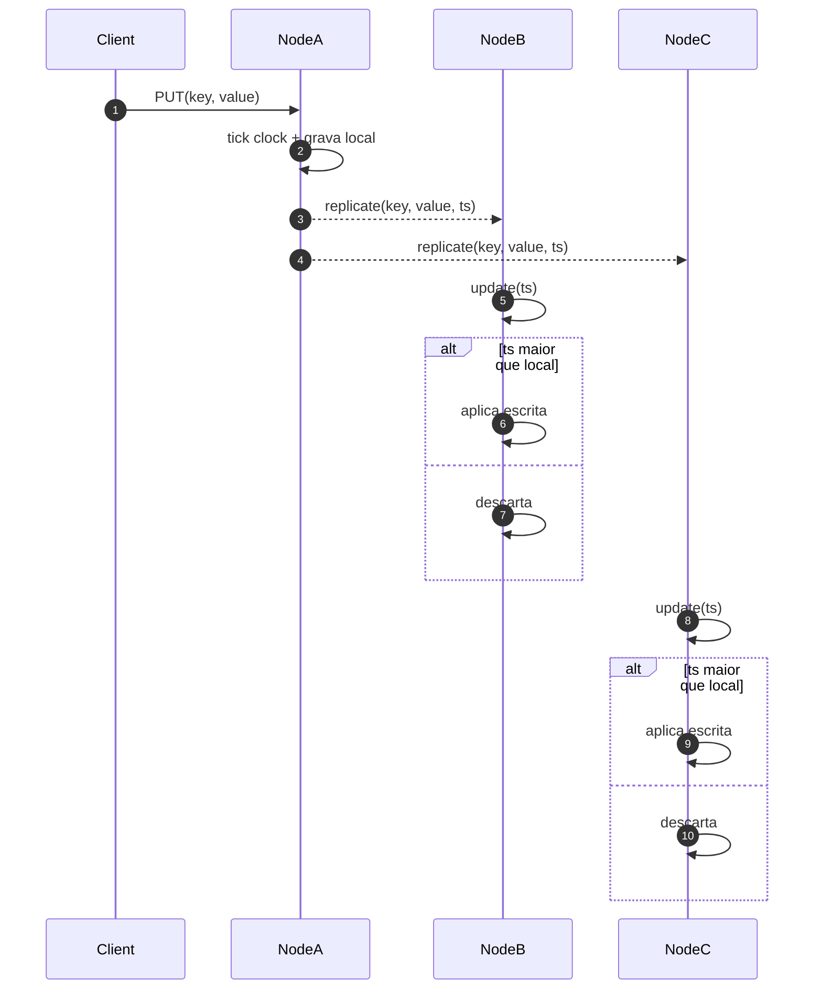
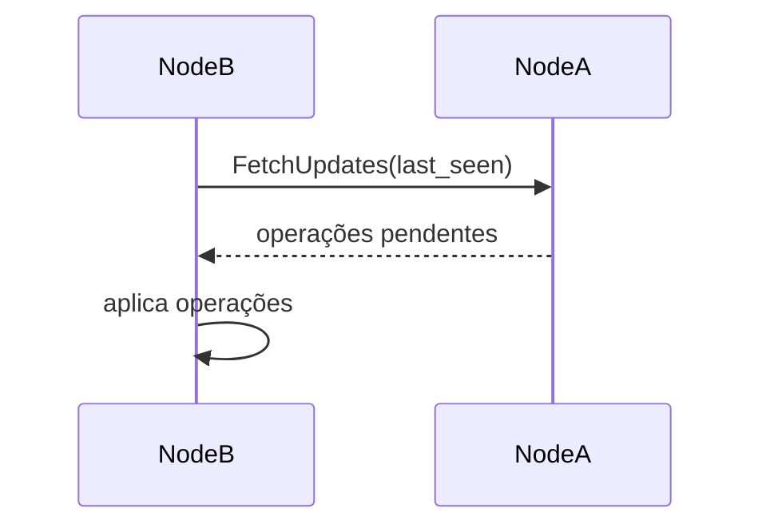
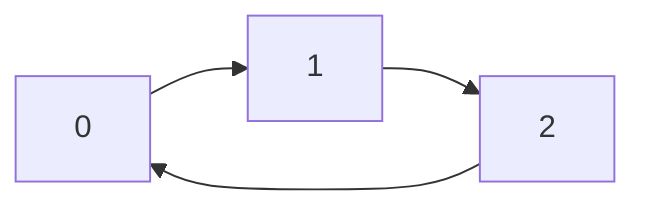
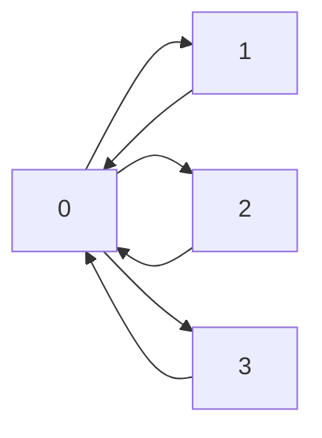

# py_distributed_database

Este projeto demonstra uma implementação didática de um banco de dados distribuído escrito em Python. Cada nó utiliza uma LSM Tree para armazenamento local e replica suas operações para os pares via gRPC. O protocolo de replicação segue o modelo **multi‑líder all‑to‑all** com resolução de conflitos baseada em **Last Write Wins (LWW)** usando relógios de **Lamport**.

## Visão geral da arquitetura


Cada instância contém seu próprio clock lógico e armazena `(valor, timestamp)`. Ao receber uma atualização de outro nó, compara os timestamps: se o recebido for maior, a escrita substitui a local; caso contrário, é descartada.

## Fluxo de escrita



A mesma regra vale para deleções, que são propagadas como *tombstones*. Isso garante **convergência eventual** de todos os nós.

## Idempotência e prevenção de duplicatas

Cada escrita replicada possui um identificador único `op_id` no formato `"<node>:<seq>"`.
Os nós mantêm um **vetor de versões** (`last_seen`) com o maior contador aplicado de cada origem.
Quando uma atualização chega:

1. Extrai-se a origem e o contador do `op_id`.
2. Se o contador é maior que `last_seen[origem]`, a operação é aplicada e o valor é atualizado.
3. Caso contrário, ela é ignorada, garantindo **idempotência**.

Operações originadas localmente são armazenadas em um **log de replicação** até que todos os pares as recebam.
Se um nó ficar offline, ele pode recuperar as mudanças perdidas ao reprovar o log quando voltar.

## Principais componentes

- **Write-Ahead Log (WAL)** – registra cada operação antes que seja aplicada, garantindo durabilidade.
- **MemTable** – estrutura em memória (Árvore Rubro-Negra) para escritas rápidas.
- **SSTables** – arquivos imutáveis que armazenam os dados permanentemente.
- **Compactação** – remove registros obsoletos ao mesclar SSTables.
- **Lamport Clock** – contador lógico usado para ordenar operações entre nós.
- **Replicação multi-líder** – qualquer nó pode aceitar escritas e replicá-las para todos os outros de forma assíncrona.
- **Driver opcional** – encaminha requisições para garantir "read your own writes".
- **Log de replicação** – armazena operações geradas localmente até que todos os pares confirmem o recebimento.
- **Vetor de versões** – cada nó mantém `last_seen` (origem → último contador) para aplicar cada operação exatamente uma vez.
- **Heartbeat** – serviço `Ping` que monitora a disponibilidade dos peers.
- **Sloppy quorum** – usa nós saudáveis extras quando os responsáveis originais estão off-line.
- **Hinted handoff** – escritas destinadas a nós indisponíveis são salvas em substitutos e reenviadas em background.
- **Read repair** – durante uma leitura, réplicas que retornarem versões antigas são atualizadas de forma assíncrona.

## Sincronização offline e anti-entropia

Para tolerar falhas temporárias de nós, o sistema oferece uma sincronização **pull**.
Ao reiniciar, um nó executa o RPC `FetchUpdates` enviando seu vetor `last_seen` e
recebe de volta as operações pendentes. Um processo em segundo plano repete esse
procedimento periodicamente para corrigir possíveis divergências (anti-entropia).



- O *replication log* é persistido em `replication_log.json` e reenviado em lotes
  para os pares.
- Caso um destino esteja inacessível, outro nó saudável guarda a atualização com `hinted_for` e a entrega quando o peer volta (hinted handoff).
- Hashes de segmentos baseados em **Merkle trees** permitem pular dados já
  sincronizados durante a troca de atualizações, enviando apenas as chaves divergentes.
  O processo roda periodicamente como anti-entropia garantindo que todas as
  réplicas eventualmente convergem.

## Executando

1. Instale as dependências (incluindo `grpcio` e `protobuf` utilizados na comunicação gRPC)
   ```bash
   pip install -r requirements.txt
   ```
2. Inicie o exemplo
   ```bash
   python main.py
   ```
   O script cria um cluster local com múltiplos nós e replica as operações entre eles.

Para consistência por usuário, utilize o `Driver`:

```python
from replication import NodeCluster
from driver import Driver

cluster = NodeCluster(num_nodes=2)
driver = Driver(cluster)
driver.put("alice", "k", "1", "v")
value = driver.get("alice", "k", "1")
cluster.shutdown()
```

## Topologia de replicação

A classe `NodeCluster` possui o parâmetro opcional `topology` que define
quais nós replicam entre si. Se ele for omitido, o cluster forma uma
malha completa (all‑to‑all), preservando o comportamento original.

O dicionário passado em `topology` usa o índice de cada nó como chave e
uma lista de destinos como valor.

O cluster também utiliza a estrutura `ConsistentHashRing` para determinar
de forma estável quais nós são responsáveis por cada chave.  O parâmetro
`replication_factor` indica quantas réplicas devem armazenar o mesmo
valor.  A inicialização com fator de replicação customizado fica:

```python
from replication import NodeCluster

cluster = NodeCluster("/tmp/hash_cluster", num_nodes=3,
                      replication_factor=2)
```

O número total de réplicas definido por `replication_factor` é chamado de **N**.
Cada escrita precisa do reconhecimento de **W** nós (`write_quorum`) e cada
leitura consulta ao menos **R** réplicas (`read_quorum`). Por padrão, `W` e `R`
são calculados como `replication_factor // 2 + 1`, mas podem ser configurados
explicitamente. Para garantir que uma leitura encontre a última escrita é comum
seguir a regra **R + W > N**.

```python
from replication import NodeCluster

cluster = NodeCluster(
    "/tmp/quorum", num_nodes=3,
    replication_factor=3,
    write_quorum=2,  # W
    read_quorum=2,   # R
)
```

Também é possível utilizar os níveis predefinidos em `consistency.py`:

```python
from replication import NodeCluster
from consistency import Consistency, level_to_quorum

w, r = level_to_quorum(Consistency.ONE, replication_factor=3)
fast_cluster = NodeCluster(
    "/tmp/fast", num_nodes=3,
    replication_factor=3,
    write_quorum=w,
    read_quorum=r,
)
```

Valores menores de `W` e `R` aumentam a disponibilidade, pois menos nós precisam
estar online. Quóruns maiores melhoram a consistência ao custo de exigir mais
réplicas ativas.

Durante essa etapa de consistência forte, uma escrita só é considerada
bem-sucedida quando todos os nós escolhidos respondem com sucesso à
chamada RPC.

### Configuração em anel

```python
from replication import NodeCluster

ring = {
    0: [1],
    1: [2],
    2: [0],
}
cluster = NodeCluster("/tmp/ring", num_nodes=3, topology=ring)
```



### Configuração em estrela

```python
from replication import NodeCluster

star = {
    0: [1, 2, 3],
    1: [0],
    2: [0],
    3: [0],
}
cluster = NodeCluster("/tmp/star", num_nodes=4, topology=star)
```



## Sloppy Quorum e Hinted Handoff

Cada nó monitora a disponibilidade dos pares com um serviço de *heartbeat*. Se um
nó responsável por determinada chave estiver fora do ar, a escrita não é
rejeitada: outros nós saudáveis são escolhidos para completar o quorum
(`sloppy quorum`). A operação é enviada ao substituto com o campo
`hinted_for` indicando o destino original.

Essas atualizações ficam registradas em `hints.json` e uma thread de fundo
verifica periodicamente se o peer voltou a responder ao heartbeat. Quando isso
ocorre o dado é transferido e o hint removido.

O mesmo princípio vale para leituras: se as réplicas preferenciais estiverem
indisponíveis, o cluster consulta nós extras até atingir `R` respostas. Durante
essa leitura, os valores retornados são comparados e réplicas desatualizadas são
atualizadas em background (read repair).

## Vector Clocks, CRDTs e modos de consistência

Além do modo padrão **LWW**, o sistema suporta controle de concorrência usando
**Vector Clocks** e estruturas **CRDT**.

O parâmetro `consistency_mode` define o algoritmo utilizado por cada nó.
Os valores possíveis são:

- `"lww"` – Last Write Wins com relógios de Lamport (padrão);
- `"vector"` – utiliza vetores de versão para detectar conflitos;
- `"crdt"` – replica o estado serializado de CRDTs pré-configurados.

Para iniciar um cluster no modo de vetores ou CRDTs:

```python
from replication import NodeCluster

# cluster usando vetores de versão
vector_cluster = NodeCluster("/tmp/vc", num_nodes=3, consistency_mode="vector")

# cluster preparado para CRDTs (ex.: contadores)
crdt_cluster = NodeCluster("/tmp/crdt", num_nodes=2, consistency_mode="crdt")
```

No modo `vector`, o método `get` retorna uma lista de todas as versões
(`[(valor, timestamp, vector)]`) presentes para a chave. Cabe à aplicação
mesclar os valores e gravar o resultado se desejar convergir.

### Exemplo de contador CRDT

Para manipular um contador grow-only (`GCounter`) é necessário criar os nós
manualmente com `NodeServer` especificando `consistency_mode="crdt"` e o mapeamento
`crdt_config` para as chaves desejadas:

```python
from tempfile import TemporaryDirectory
from replica.grpc_server import NodeServer

cfg = {"c": "gcounter"}

with TemporaryDirectory() as dir_a, TemporaryDirectory() as dir_b:
    node_a = NodeServer(dir_a, node_id="A", peers=[("localhost", 8001, "B")],
                        consistency_mode="crdt", crdt_config=cfg)
    node_b = NodeServer(dir_b, node_id="B", peers=[("localhost", 8000, "A")],
                        consistency_mode="crdt", crdt_config=cfg)
    node_a.start(); node_b.start()

    node_a.apply_crdt("c", 1)
    node_b.apply_crdt("c", 2)

    print(node_a.crdts["c"].value)  # 3
    print(node_b.crdts["c"].value)  # 3

    node_a.stop(); node_b.stop()
```

## Chaves Compostas

Chaves podem ter dois componentes: a **chave de partição** e a
**chave de clusterização**. A função `compose_key(partition_key, clustering_key)`
gera uma representação unificada no formato `"particao|cluster"`. Quando apenas o
primeiro componente é usado, a chave permanece como uma string simples.

No particionamento por hash, somente a **chave de partição** é usada no cálculo
do hash. Assim, todos os registros com o mesmo prefixo permanecem na mesma
partição, independentemente do valor de clusterização.

Exemplo básico de uso:

```python
from replication import NodeCluster

cluster = NodeCluster('/tmp/demo', num_nodes=2, partition_strategy='hash')

cluster.put(0, 'user1', '001', 'Alice')
cluster.put(0, 'user1', '002', 'Bob')

print(cluster.get(1, 'user1', '001'))  # 'Alice'
print(cluster.get_range('user1', '000', '999'))
cluster.shutdown()
```

## Particionamento por Faixa de Chave

Também é possível distribuir as chaves manualmente por intervalos,
associando cada partição a um nó específico. Para isso, informe a lista
de faixas em `key_ranges` ao criar o cluster:

```python
from replication import NodeCluster

ranges = [('a', 'm'), ('m', None)]  # exemplo
cluster = NodeCluster('/tmp/range_cluster', num_nodes=2, key_ranges=ranges)
```

Cada tupla define o início e o fim (exclusivo) de uma faixa. No exemplo
acima, o primeiro nó cuida das chaves de `'a'` até `'m'` e o segundo das
demais. Por enquanto cada partição possui apenas uma réplica, mas o
projeto prevê suportar múltiplas cópias e realocação dinâmica das
faixas em versões futuras.

## Particionamento por Hash de Chave

Além das faixas definidas manualmente, o cluster pode distribuir as chaves
automaticamente calculando `hash(key) % num_partitions`.
Cada partição corresponde a um nó (ou réplica) responsável pelo armazenamento.

```python
from replication import NodeCluster

cluster = NodeCluster('/tmp/hash_cluster', num_nodes=3,
                      partition_strategy='hash',
                      replication_factor=1)
```

Essa estratégia tende a balancear bem os dados entre os nós, mas consultas por
faixa de valores precisam acessar várias partições para coletar todos os
resultados.

## Testes

Execute a bateria de testes para validar o sistema. Instale antes as
dependências listadas em `requirements.txt`:
```bash
pip install -r requirements.txt
python -m unittest discover -s tests -v
```

## Estrutura de arquivos

- `main.py` – exemplo de inicialização do cluster.
- `lsm_db.py`, `mem_table.py`, `wal.py`, `sstable.py` – implementação da LSM Tree.
- `replication.py` e `replica/` – lógica de replicação gRPC e serviços.
- `tests/` – casos de teste.
