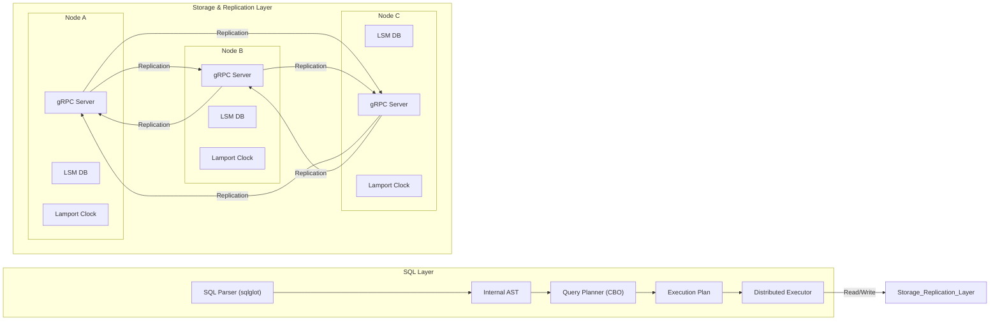
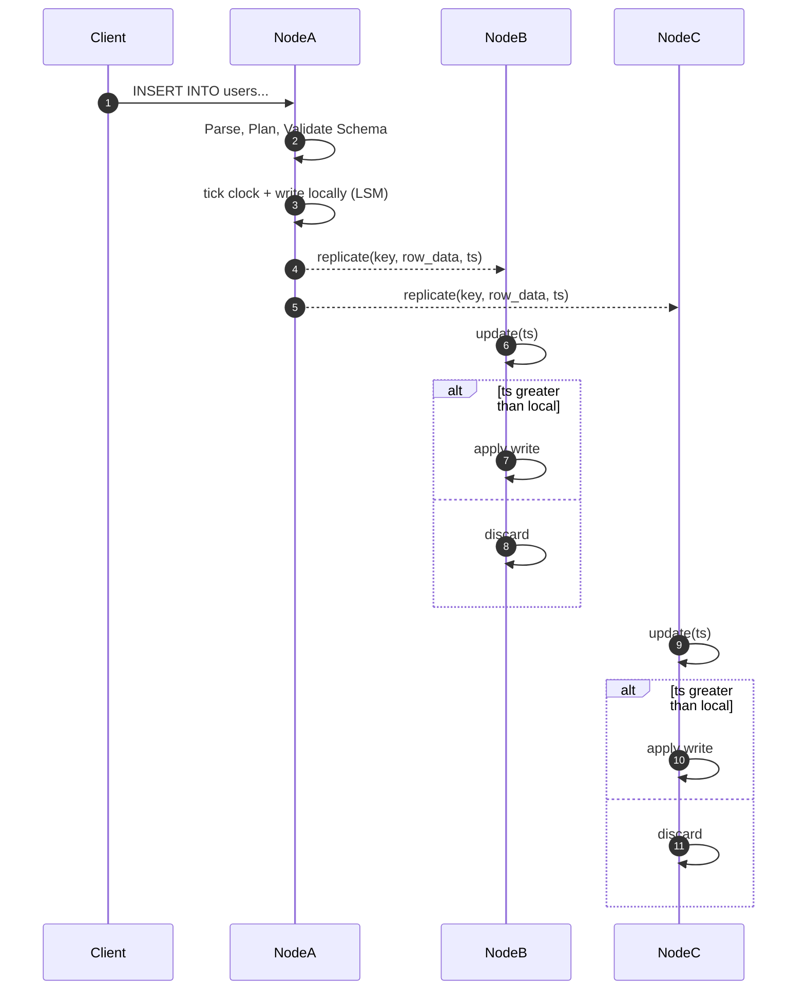

# Relational Distributed Database in Python from Scratch

This project showcases a didactic implementation of a **distributed relational database** built from the ground up in Python. It features a SQL-like interface, a query planner, and a distributed execution engine, all layered on top of a durable, replicated key-value store using an LSM Tree. Replication at the storage layer follows a **multi‑leader all‑to‑all** model with conflict resolution based on **Last Write Wins (LWW)** using **Lamport clocks**.

## From Key-Value to Relational
This project has evolved from a simple distributed key-value store into a system with relational capabilities. It now includes:
- A **System Catalog** to manage table schemas, stored directly within the database.
- A **SQL Parser and Planner** that can understand a subset of SQL, including DDL (`CREATE TABLE`, `ALTER TABLE`) and DML (`INSERT`, `UPDATE`, `DELETE`, `SELECT`).
- A **Cost-Based Optimizer (CBO)** that chooses between execution strategies like full table scans (`SeqScan`) and index-based lookups (`IndexScan`).
- **Distributed Query Execution** using a scatter-gather model for parallel processing.
- **Secondary Indexing** to accelerate queries.
- **Transactional Support** with snapshot isolation and row-level locking.

## Architecture overview
The underlying storage and replication architecture remains a multi-leader, eventually consistent system. A SQL processing layer is built on top of this foundation.


Each node's LSM Tree stores not only user data but also system catalog information (e.g., table schemas) using reserved keys. Changes to the catalog are replicated just like regular data, ensuring all nodes eventually converge to the same schema definition.

## Write flow
A DML operation like `INSERT` or `UPDATE` is parsed and planned, then translated into one or more `Put` operations at the storage layer. These `Put` operations are then replicated to peers.



The same rule applies to `DELETE` operations, which propagate as *tombstones*, ensuring **eventual convergence** of all replicas.

## Main components
- **System Catalog**: Stores table and index schemas as special keys within the database itself, ensuring metadata is replicated along with data.
- **SQL Parser**: Uses `sqlglot` to parse SQL strings into an Abstract Syntax Tree (AST).
- **Query Planner**: A cost-based optimizer (CBO) that analyzes the AST and statistics to choose the most efficient execution plan (e.g., `SeqScan` vs. `IndexScan`).
- **Distributed Execution Engine**: Coordinates query execution across multiple nodes using a scatter-gather pattern.
- **Row-based Storage**: Table rows are serialized using MessagePack for efficient storage and retrieval.
- **Write-Ahead Log (WAL)**: Records each operation before applying it, ensuring durability.
- **LSM Tree**: Each node uses a Log-Structured Merge-Tree (`MemTable`, `SSTables`, Compaction) for its local storage engine.
- **Multi-leader Replication**: Any node can accept writes, which are asynchronously replicated.
- **Lamport Clocks & Vector Clocks**: Used for ordering operations and conflict resolution.
- **Topology-Aware Driver**: An optional client that caches the partition map to route requests directly to the correct node.
- **Secondary Indexes**: In-memory indexes on non-primary-key columns to speed up queries.
- **Heartbeat & Hinted Handoff**: For fault tolerance, writes to offline nodes are temporarily stored by healthy nodes and delivered later.
- **Read Repair**: Outdated replicas are asynchronously updated during reads.

## Running

1.  Install the dependencies (including `grpcio`, `protobuf`, and `sqlglot`):
    ```bash
    pip install -r requirements.txt
    ```
2.  Start the example cluster:
    ```bash
    python main.py
    ```
    This script launches a local `NodeCluster` and a FastAPI server that exposes a REST API and a web-based UI.

### SQL Interface

The primary way to interact with the database is through SQL. You can execute DDL and DML statements via the API.

**DDL Example (`CREATE TABLE`)**
```python
# Via GRPCReplicaClient
client.execute_ddl("CREATE TABLE users (id INT PRIMARY KEY, name STRING)")
```

**DML Example (`INSERT`, `SELECT`)**
```python
# The system does not yet expose a direct SQL client in Python,
# but queries can be sent via the API endpoints.
# (See API section below)
```

### Low-Level API

While SQL is the preferred interface, the system still exposes a lower-level Key-Value API for direct data manipulation and inspection, which is used by the UI's Data Browser.

| Method | Path                                             | Description                                      |
| :----- | :----------------------------------------------- | :----------------------------------------------- |
| `GET`  | `/data/records`                                  | List records with optional pagination.           |
| `POST` | `/data/records`                                  | Insert a new raw record.                         |
| `PUT`  | `/data/records/{partition_key}/{clustering_key}` | Update a raw record.                             |
| `GET`  | `/data/query_index`                              | Query a secondary index.                         |
| `GET`  | `/nodes/{id}/wal`                                | Inspect a node's Write-Ahead Log.                |
| `GET`  | `/nodes/{id}/memtable`                           | Inspect a node's MemTable contents.              |
| `GET`  | `/nodes/{id}/sstables`                           | View SSTable metadata for a node.                |

### Cluster Management API

The API also exposes maintenance operations to manage the cluster:

| Method | Path                                     | Description                             |
| :----- | :--------------------------------------- | :-------------------------------------- |
| `POST` | `/cluster/actions/check_hot_partitions`  | Split partitions with heavy traffic.    |
| `POST` | `/cluster/actions/split_partition`       | Manually divide a partition.            |
| `POST` | `/cluster/actions/merge_partitions`      | Merge two adjacent partitions.          |
| `POST` | `/cluster/actions/rebalance`             | Evenly redistribute partitions.         |

### Relational UI
The project includes a web-based dashboard and management UI in the `app/` directory. It provides:
- **SQL Editor**: An interactive editor to run SQL queries and view results.
- **Schema Browser**: A tool to view all tables, their columns, types, and defined indexes.
- **Query Plan Visualizer**: An `EXPLAIN`-like feature to inspect the execution plan chosen by the query optimizer.
- **Cluster Dashboard**: Health and performance metrics for nodes and partitions.

## Sharding and Partitioning
The database distributes data across nodes using partitioning.
- **Partitioning Strategies**: Supports both hash-based partitioning (for even load distribution) and range-based partitioning (for efficient range scans).
- **Virtual Partitions (vnodes)**: By using a `ConsistentHashPartitioner`, each physical node can be responsible for many small virtual partitions, which allows for smoother rebalancing when nodes are added or removed.

## Transactions
The database supports transactions with snapshot isolation.
- **ACID Operations**: Start a transaction with `BeginTransaction`, issue `Put` or `Delete` operations with the `tx_id`, and finalize with `CommitTransaction` or `AbortTransaction`.
- **Snapshot Isolation**: Each transaction operates on a consistent snapshot of the database, preventing dirty reads.
- **Conflict Detection**: Commits will fail if another transaction has modified a row that was read, preventing lost updates.
- **Row-level Locking**: Use the `GetForUpdate` RPC to acquire a lock on a row, preventing write skew and ensuring read-modify-write operations are safe.
- **Configurable Locking**: Use `tx_lock_strategy="2pl"` to enable pessimistic two-phase locking.

```python
from replication import NodeCluster
from replica.client import GRPCReplicaClient

cluster = NodeCluster('/tmp/tx_demo', num_nodes=1)
client = cluster.nodes[0].client

# Basic transaction
tx = client.begin_transaction()
client.put('users||1', '{"id": 1, "name": "alice"}', tx_id=tx)
client.commit_transaction(tx)

# Read-modify-write with locking
tx2 = client.begin_transaction()
current = client.get_for_update('counters||c1', tx_id=tx2)[0][0]
client.put('counters||c1', str(int(current) + 1), tx_id=tx2)
client.commit_transaction(tx2)
```

## Tests

Run the full test suite to validate the system. Install dependencies from `requirements.txt` first:
```bash
pip install -r requirements.txt
python -m unittest discover -s tests -v
```

## File structure

```
api/                 # HTTP API entry points
app/                 # Frontend web application (React)
database/
  clustering/        # Partitioning, routing, and cluster management
  lsm/               # LSM Tree storage engine implementation
  replication/       # gRPC replication logic and services
  sql/               # SQL parser, planner, and execution engine
  utils/             # Shared utilities (clocks, CRDTs, etc.)
driver.py            # Topology-aware client
main.py              # Main application entry point
tests/               # Unit and integration tests
```

## Example Configurations

Several small scripts under `examples/` start the cluster with different options. Each one launches the React UI in the background while the API runs in the foreground. Run them with `python examples/<file>.py` and visit the printed URLs.

- `hash_cluster.py`: Demonstrates table creation and basic SQL queries on a hash‑partitioned cluster.
- `range_cluster.py`: Creates a table and inserts rows in a range‑partitioned cluster.
- `index_cluster.py`: Shows secondary indexes with SQL `SELECT` queries.
- `router_cluster.py`: Uses the gRPC router to execute SQL inserts and reads.

## Running with Docker

The project can be fully containerized using Docker and Docker Compose.

### Build and Run a Single Example
To avoid compatibility issues, especially on Windows, run the project inside Docker. First, install **Docker Desktop**.
```bash
# Build the Docker image
docker build -t py_db .

# Run the default hash_cluster.py example
docker run -p 8000:8000 -p 5173:5173 py_db
```

### Running with Docker Compose
The repository includes a `docker-compose.yml` file that starts a 3-node cluster with a metadata registry service.
```bash
docker compose up --build
```
This will launch all services. The UI for each node and the central registry will be available on `localhost` at their configured ports:
- **node1:** [http://localhost:8001](http://localhost:8001) (gRPC on `50051`)
- **node2:** [http://localhost:8002](http://localhost:8002) (gRPC on `50052`)
- **node3:** [http://localhost:8003](http://localhost:8003) (gRPC on `50053`)
- **registry:** Port `9100`

To add more nodes, you can scale the service:
```bash
docker compose up --scale node=5
```
