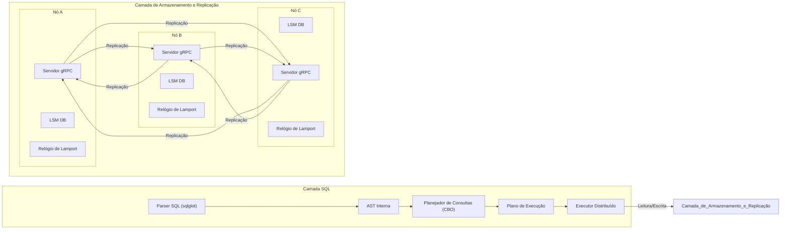
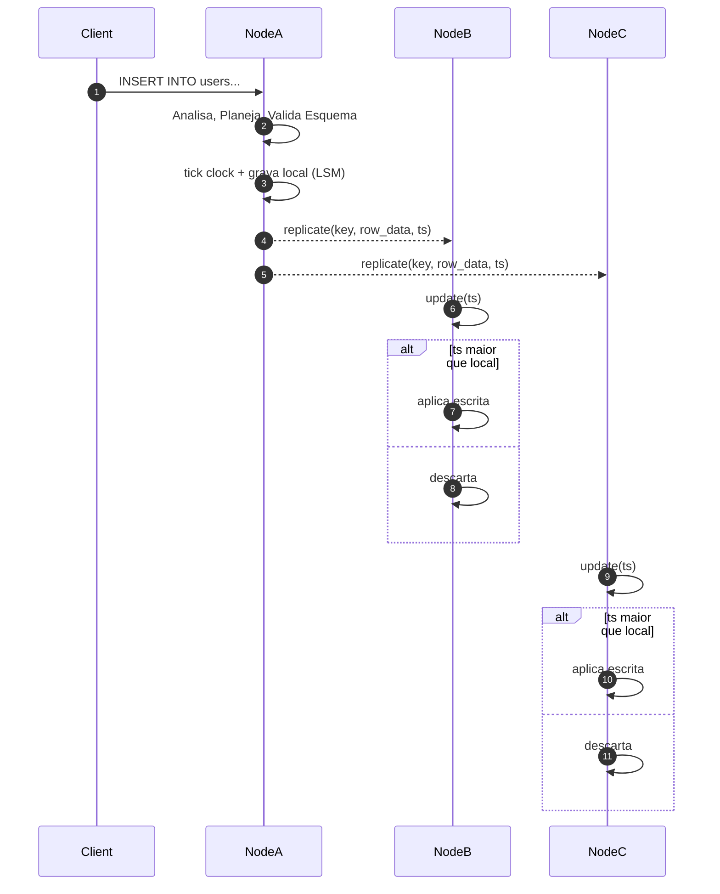

# Banco de Dados Relacional Distribuído em Python do Zero

Este projeto demonstra uma implementação didática de um **banco de dados relacional distribuído** construído do zero em Python. Ele apresenta uma interface do tipo SQL, um planejador de consultas e um motor de execução distribuída, todos em camadas sobre um armazenamento de chave-valor durável e replicado que utiliza uma LSM Tree. A replicação na camada de armazenamento segue o modelo **multi-líder all-to-all** com resolução de conflitos baseada em **Last Write Wins (LWW)** usando relógios de **Lamport**.

## De Chave-Valor para Relacional
Este projeto evoluiu de um simples armazenamento de chave-valor distribuído para um sistema com capacidades relacionais. Ele agora inclui:
- Um **Catálogo de Sistema** para gerenciar esquemas de tabelas, armazenado diretamente no banco de dados.
- Um **Parser e Planejador SQL** que entende um subconjunto de SQL, incluindo DDL (`CREATE TABLE`, `ALTER TABLE`) e DML (`INSERT`, `UPDATE`, `DELETE`, `SELECT`).
- Um **Otimizador Baseado em Custo (CBO)** que escolhe entre estratégias de execução como varreduras completas de tabela (`SeqScan`) e buscas baseadas em índice (`IndexScan`).
- **Execução de Consultas Distribuída** usando um modelo scatter-gather para processamento paralelo.
- **Indexação Secundária** para acelerar consultas.
- **Suporte a Transações** com isolamento de snapshot e bloqueio em nível de linha.
- **Estatísticas de Tabelas** coletadas com `ANALYZE TABLE` e acessíveis pela API de estatísticas e pelo dashboard.

## Visão geral da arquitetura
A arquitetura de armazenamento e replicação subjacente permanece um sistema multi-líder e eventualmente consistente. Uma camada de processamento SQL é construída sobre essa base.


A LSM Tree de cada nó armazena não apenas os dados do usuário, mas também as informações do catálogo do sistema (ex: esquemas de tabela) usando chaves reservadas. As alterações no catálogo são replicadas como dados comuns, garantindo que todos os nós eventualmente convirjam para a mesma definição de esquema.

## Fluxo de escrita
Uma operação DML como `INSERT` ou `UPDATE` é analisada e planejada, depois traduzida para uma ou mais operações `Put` na camada de armazenamento. Essas operações `Put` são então replicadas para os pares.



A mesma regra se aplica a operações de `DELETE`, que são propagadas como *tombstones*, garantindo a **convergência eventual** de todas as réplicas.

## Principais componentes
- **Catálogo de Sistema**: Armazena esquemas de tabelas e índices como chaves especiais dentro do próprio banco de dados, garantindo que os metadados sejam replicados junto com os dados.
- **Parser SQL**: Usa `sqlglot` para analisar strings SQL em uma Árvore de Sintaxe Abstrata (AST).
- **Planejador de Consultas**: Um otimizador baseado em custo (CBO) que analisa a AST e estatísticas para escolher o plano de execução mais eficiente (ex: `SeqScan` vs. `IndexScan`).
- **Motor de Execução Distribuída**: Coordena a execução de consultas em múltiplos nós usando um padrão scatter-gather.
- **Armazenamento Orientado a Linha**: As linhas da tabela são serializadas usando MessagePack para armazenamento e recuperação eficientes.
- **Write-Ahead Log (WAL)**: Registra cada operação antes de aplicá-la, garantindo a durabilidade.
- **LSM Tree**: Cada nó usa uma Log-Structured Merge-Tree (`MemTable`, `SSTables`, Compactação) para seu motor de armazenamento local.
- **Replicação Multi-líder**: Qualquer nó pode aceitar escritas, que são replicadas de forma assíncrona.
- **Relógios de Lamport e Vetores de Versão**: Usados para ordenar operações e resolver conflitos.
- **Driver Consciente da Topologia**: Um cliente opcional que mantém um cache do mapa de partições para rotear requisições diretamente para o nó correto.
- **Índices Secundários**: Índices em memória em colunas que não são chaves primárias para acelerar consultas.
- **Heartbeat e Hinted Handoff**: Para tolerância a falhas, escritas para nós offline são armazenadas temporariamente por nós saudáveis e entregues posteriormente.
- **Read Repair**: Réplicas desatualizadas são atualizadas de forma assíncrona durante as leituras.

## Executando

1.  Instale as dependências (incluindo `grpcio`, `protobuf` e `sqlglot`):
    ```bash
    pip install -r requirements.txt
    ```
2.  Inicie o exemplo:
    ```bash
    python main.py
    ```
    Este script cria um `NodeCluster` local e um servidor FastAPI que expõe uma API REST e uma interface web.

### Interface SQL

A principal forma de interagir com o banco de dados é através de SQL. Você pode executar comandos DDL e DML através da API.

**Exemplo DDL (`CREATE TABLE`)**
```python
# Via GRPCReplicaClient
client.execute_ddl("CREATE TABLE users (id INT PRIMARY KEY, name STRING)")
```

**Exemplo DML (`INSERT`, `SELECT`)**
```python
# O sistema ainda não expõe um cliente SQL direto em Python,
# mas as consultas podem ser enviadas através dos endpoints da API.
# (Veja a seção da API abaixo)
```

### API de Baixo Nível

Embora SQL seja a interface preferencial, o sistema ainda expõe uma API de Chave-Valor de nível mais baixo para manipulação e inspeção direta de dados, que é usada pelo Data Browser da UI.

| Método | Caminho                                          | Descrição                                         |
| :----- | :----------------------------------------------- | :------------------------------------------------ |
| `GET`  | `/data/records`                                  | Lista registros brutos com paginação opcional.    |
| `POST` | `/data/records`                                  | Insere um novo registro bruto.                    |
| `PUT`  | `/data/records/{partition_key}/{clustering_key}` | Atualiza um registro bruto.                       |
| `GET`  | `/data/query_index`                              | Consulta um índice secundário.                    |
| `GET`  | `/nodes/{id}/wal`                                | Inspeciona o Write-Ahead Log de um nó.            |
| `GET`  | `/nodes/{id}/memtable`                           | Inspeciona o conteúdo da MemTable de um nó.       |
| `GET`  | `/nodes/{id}/sstables`                           | Visualiza metadados de SSTables para um nó.       |

### API de Gerenciamento do Cluster

A API também expõe operações de manutenção para gerenciar o cluster:

| Método | Caminho                                    | Descrição                                 |
| :----- | :--------------------------------------- | :---------------------------------------- |
| `POST` | `/cluster/actions/check_hot_partitions`  | Divide partições com tráfego intenso.     |
| `POST` | `/cluster/actions/split_partition`       | Divide manualmente uma partição.          |
| `POST` | `/cluster/actions/merge_partitions`      | Mescla duas partições adjacentes.         |
| `POST` | `/cluster/actions/rebalance`             | Redistribui as partições uniformemente.   |

### API de Estatísticas
Endpoints para coletar e consultar estatísticas de tabelas:

| Método | Caminho | Descrição |
| :----- | :------ | :--------- |
| `POST` | `/actions/analyze/{table}` | Calcula estatísticas para a tabela. |
| `GET`  | `/stats/table/{table}` | Obtém estatísticas gerais da tabela. |
| `GET`  | `/stats/table/{table}/columns` | Obtém estatísticas por coluna. |

### UI Relacional
O projeto inclui um dashboard web e uma UI de gerenciamento no diretório `app/`. Ela fornece:
- **Editor SQL**: Um editor interativo para executar consultas SQL e visualizar os resultados.
- **Navegador de Esquema**: Uma ferramenta para visualizar todas as tabelas, suas colunas, tipos e índices definidos.
- **Visualizador de Plano de Consulta**: Um recurso semelhante ao `EXPLAIN` para inspecionar o plano de execução escolhido pelo otimizador de consultas.
- **Dashboard do Cluster**: Métricas de saúde e desempenho para nós e partições.
- **Dashboard de Estatísticas**: Visualiza contagens de linhas e cardinalidade de colunas.

## Sharding e Particionamento
O banco de dados distribui os dados entre os nós usando particionamento.
- **Estratégias de Particionamento**: Suporta tanto particionamento por hash (para distribuição de carga uniforme) quanto por faixa de valores (para varreduras de intervalo eficientes).
- **Partições Virtuais (vnodes)**: Usando um `ConsistentHashPartitioner`, cada nó físico pode ser responsável por muitas pequenas partições virtuais, o que permite um rebalanceamento mais suave quando nós são adicionados ou removidos.

## Transações
O banco de dados suporta transações com isolamento de snapshot.
- **Operações ACID**: Inicie uma transação com `BeginTransaction`, emita operações `Put` ou `Delete` com o `tx_id`, e finalize com `CommitTransaction` ou `AbortTransaction`.
- **Isolamento de Snapshot**: Cada transação opera em um snapshot consistente do banco de dados, evitando leituras sujas.
- **Detecção de Conflitos**: Commits falharão se outra transação tiver modificado uma linha que foi lida, prevenindo perdas de atualização.
- **Bloqueio em Nível de Linha**: Use o RPC `GetForUpdate` para adquirir um bloqueio em uma linha, evitando *write skew* e garantindo que operações de leitura-modificação-escrita sejam seguras.
- **Bloqueio Configurável**: Use `tx_lock_strategy="2pl"` para habilitar o bloqueio pessimista de duas fases.

```python
from replication import NodeCluster
from replica.client import GRPCReplicaClient

cluster = NodeCluster('/tmp/tx_demo', num_nodes=1)
client = cluster.nodes[0].client

# Transação básica
tx = client.begin_transaction()
client.put('users||1', '{"id": 1, "name": "alice"}', tx_id=tx)
client.commit_transaction(tx)

# Leitura-modificação-escrita com bloqueio
tx2 = client.begin_transaction()
current = client.get_for_update('counters||c1', tx_id=tx2)[0][0]
client.put('counters||c1', str(int(current) + 1), tx_id=tx2)
client.commit_transaction(tx2)
```

## Testes

Execute a suíte de testes completa para validar o sistema. Instale as dependências de `requirements.txt` primeiro:
```bash
pip install -r requirements.txt
python -m unittest discover -s tests -v
```

## Estrutura de arquivos

```
api/                 # Pontos de entrada da API HTTP
app/                 # Aplicação frontend (React)
database/
  clustering/        # Particionamento, roteamento e gerenciamento de cluster
  lsm/               # Implementação do motor de armazenamento LSM Tree
  replication/       # Lógica de replicação gRPC e serviços
  sql/               # Parser, planejador e motor de execução SQL
  utils/             # Utilitários compartilhados (relógios, CRDTs, etc.)
driver.py            # Cliente consciente da topologia
main.py              # Ponto de entrada principal da aplicação
tests/               # Testes de unidade e integração
```

## Configurações de Exemplo

Vários pequenos scripts em `examples/` iniciam o cluster com diferentes opções. Cada um deles lança a UI em React em segundo plano enquanto a API roda em primeiro plano. Execute-os com `python examples/<file>.py` e visite as URLs impressas.

- `hash_cluster.py`: Demonstra criação de tabela e consultas SQL básicas em um cluster particionado por hash.
- `range_cluster.py`: Cria uma tabela e insere linhas em um cluster particionado por faixas.
- `index_cluster.py`: Mostra índices secundários com consultas `SELECT` em SQL.
- `router_cluster.py`: Usa o roteador gRPC para executar inserções e leituras SQL.

## Executando com Docker

O projeto pode ser totalmente containerizado usando Docker e Docker Compose.

### Construir e Executar um Exemplo
Para evitar problemas de compatibilidade, especialmente no Windows, execute o projeto dentro do Docker. Primeiro, instale o **Docker Desktop**.
No Windows, o gRPC pode emitir avisos ao tentar vincular `localhost`. O
cluster agora converte automaticamente `localhost` para `127.0.0.1`, mas
você também pode definir explicitamente `host="127.0.0.1"` ao criar o
`NodeCluster`.
```bash
# Construir a imagem Docker
docker build -t py_db .

# Executar o exemplo padrão hash_cluster.py
docker run -p 8000:8000 -p 5173:5173 py_db
```

### Executando com Docker Compose
O repositório inclui um arquivo `docker-compose.yml` que inicia um cluster de 3 nós com um serviço de registro de metadados.
```bash
docker compose up --build
```
Isso iniciará todos os serviços. A UI para cada nó e o registro central estarão disponíveis em `localhost` em suas portas configuradas:
- **node1:** [http://localhost:8001](http://localhost:8001) (gRPC em `50051`)
- **node2:** [http://localhost:8002](http://localhost:8002) (gRPC em `50052`)
- **node3:** [http://localhost:8003](http://localhost:8003) (gRPC em `50053`)
- **registry:** Porta `9100`

Para adicionar mais nós, você pode escalar o serviço:
```bash
docker compose up --scale node=5
```
