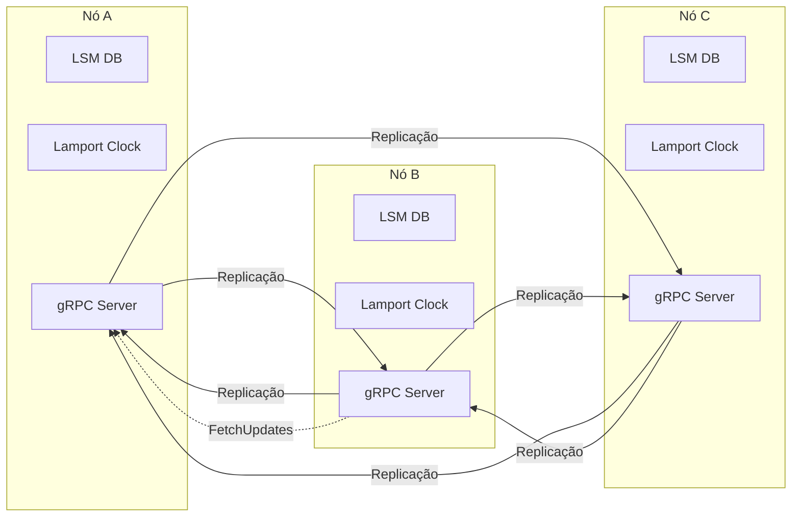
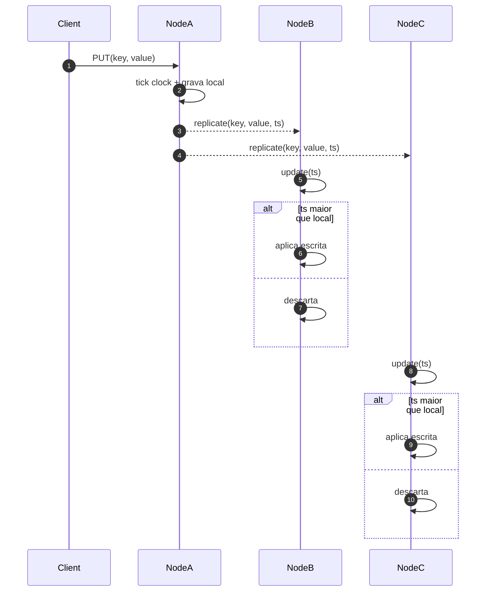
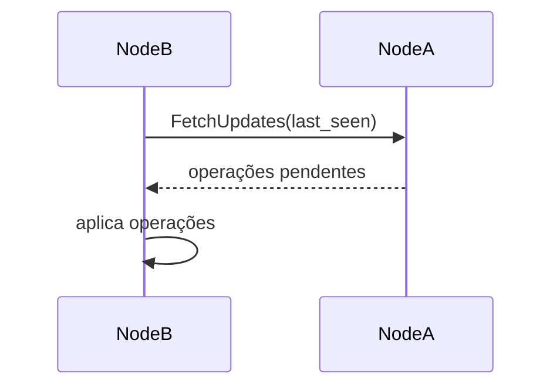
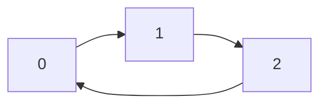
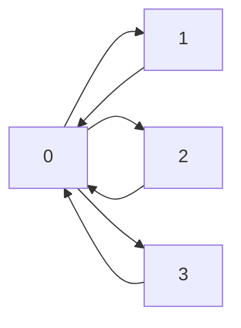
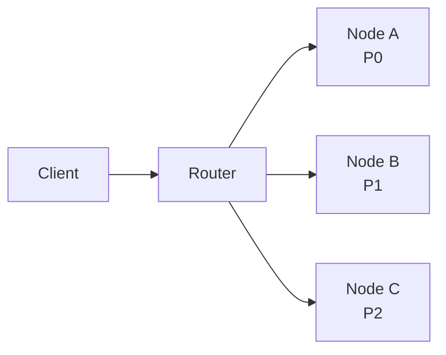

# py_distributed_database

Este projeto demonstra uma implementação didática de um banco de dados distribuído escrito em Python. Cada nó utiliza uma LSM Tree para armazenamento local e replica suas operações para os pares via gRPC. O protocolo de replicação segue o modelo **multi‑líder all‑to‑all** com resolução de conflitos baseada em **Last Write Wins (LWW)** usando relógios de **Lamport**.

## Visão geral da arquitetura



Cada instância contém seu próprio clock lógico e armazena `(valor, timestamp)`. Ao receber uma atualização de outro nó, compara os timestamps: se o recebido for maior, a escrita substitui a local; caso contrário, é descartada.

## Fluxo de escrita



A mesma regra vale para deleções, que são propagadas como *tombstones*. Isso garante **convergência eventual** de todos os nós.

## Idempotência e prevenção de duplicatas

Cada escrita replicada possui um identificador único `op_id` no formato `"<node>:<seq>"`.
Os nós mantêm um **vetor de versões** (`last_seen`) com o maior contador aplicado de cada origem.
Quando uma atualização chega:

1. Extrai-se a origem e o contador do `op_id`.
2. Se o contador é maior que `last_seen[origem]`, a operação é aplicada e o valor é atualizado.
3. Caso contrário, ela é ignorada, garantindo **idempotência**.

Operações originadas localmente são armazenadas em um **log de replicação** até que todos os pares as recebam.
Se um nó ficar offline, ele pode recuperar as mudanças perdidas ao reprovar o log quando voltar.

## Principais componentes

- **Write-Ahead Log (WAL)** – registra cada operação antes que seja aplicada, garantindo durabilidade.
- **MemTable** – estrutura em memória (Árvore Rubro-Negra) para escritas rápidas.
- **SSTables** – arquivos imutáveis que armazenam os dados permanentemente.
- **Compactação** – remove registros obsoletos ao mesclar SSTables.
- **Lamport Clock** – contador lógico usado para ordenar operações entre nós.
- **Replicação multi-líder** – qualquer nó pode aceitar escritas e replicá-las para todos os outros de forma assíncrona.
- **Driver opcional** – cliente consciente da topologia que mantém cache de partições.
- **Cache LRU opcional** – cada nó pode armazenar leituras recentes definindo `cache_size` no `NodeServer`.
- **Índices secundários opcionais** – defina `index_fields` no `NodeServer` para manter índices simples em memória.
- **Índices globais opcionais** – defina `global_index_fields` no `NodeServer` ou `NodeCluster` para reconstruir índices globais na inicialização.
- **Log de replicação** – armazena operações geradas localmente até que todos os pares confirmem o recebimento.
- **Vetor de versões** – cada nó mantém `last_seen` (origem → último contador) para aplicar cada operação exatamente uma vez.
- **Heartbeat** – serviço `Ping` que monitora a disponibilidade dos peers.
- **Sloppy quorum** – usa nós saudáveis extras quando os responsáveis originais estão off-line.
- **Hinted handoff** – escritas destinadas a nós indisponíveis são salvas em substitutos e reenviadas em background.
- **Read repair** – durante uma leitura, réplicas que retornarem versões antigas são atualizadas de forma assíncrona.

## Sincronização offline e anti-entropia

Para tolerar falhas temporárias de nós, o sistema oferece uma sincronização **pull**.
Ao reiniciar, um nó executa o RPC `FetchUpdates` enviando seu vetor `last_seen` e
recebe de volta as operações pendentes. Um processo em segundo plano repete esse
procedimento periodicamente para corrigir possíveis divergências (anti-entropia).



- O *replication log* é persistido em `replication_log.json` e reenviado em lotes
  para os pares.
- Caso um destino esteja inacessível, outro nó saudável guarda a atualização com `hinted_for` e a entrega quando o peer volta (hinted handoff).
- Hashes de segmentos baseados em **Merkle trees** permitem pular dados já
  sincronizados durante a troca de atualizações, enviando apenas as chaves divergentes.
  O processo roda periodicamente como anti-entropia garantindo que todas as
  réplicas eventualmente convergem.

## Executando

1. Instale as dependências (incluindo `grpcio` e `protobuf` utilizados na comunicação gRPC)
   ```bash
   pip install -r requirements.txt
   ```
2. Inicie o exemplo
   ```bash
   python main.py
   ```
   O script cria um cluster local com múltiplos nós e replica as operações entre eles.

Para consistência por usuário, utilize o `Driver`:

```python
from replication import NodeCluster
from driver import Driver

cluster = NodeCluster(num_nodes=2)
driver = Driver(cluster)
driver.put("alice", "k", "1", "v")
value = driver.get("alice", "k", "1")
cluster.shutdown()
```

### Cliente Consciente da Topologia

O driver mantém um cache local do mapeamento de partições obtido com
`get_partition_map()`. As requisições são enviadas diretamente ao nó
responsável. Caso o nó retorne o erro `NotOwner` (por exemplo após uma
migração de partição), o driver atualiza o cache e repete a operação.

## Topologia de replicação

A classe `NodeCluster` possui o parâmetro opcional `topology` que define
quais nós replicam entre si. Se ele for omitido, o cluster forma uma
malha completa (all‑to‑all), preservando o comportamento original.

O dicionário passado em `topology` usa o índice de cada nó como chave e
uma lista de destinos como valor.

O cluster também utiliza a estrutura `ConsistentHashRing` para determinar
de forma estável quais nós são responsáveis por cada chave.  O parâmetro
`replication_factor` indica quantas réplicas devem armazenar o mesmo
valor.  A inicialização com fator de replicação customizado fica:

```python
from replication import NodeCluster

cluster = NodeCluster("/tmp/hash_cluster", num_nodes=3,
                      replication_factor=2)
```

O número total de réplicas definido por `replication_factor` é chamado de **N**.
Cada escrita precisa do reconhecimento de **W** nós (`write_quorum`) e cada
leitura consulta ao menos **R** réplicas (`read_quorum`). Por padrão, `W` e `R`
são calculados como `replication_factor // 2 + 1`, mas podem ser configurados
explicitamente. Para garantir que uma leitura encontre a última escrita é comum
seguir a regra **R + W > N**.

```python
from replication import NodeCluster

cluster = NodeCluster(
    "/tmp/quorum", num_nodes=3,
    replication_factor=3,
    write_quorum=2,  # W
    read_quorum=2,   # R
)
```

Também é possível utilizar os níveis predefinidos em `consistency.py`:

```python
from replication import NodeCluster
from consistency import Consistency, level_to_quorum

w, r = level_to_quorum(Consistency.ONE, replication_factor=3)
fast_cluster = NodeCluster(
    "/tmp/fast", num_nodes=3,
    replication_factor=3,
    write_quorum=w,
    read_quorum=r,
)
```

Valores menores de `W` e `R` aumentam a disponibilidade, pois menos nós precisam
estar online. Quóruns maiores melhoram a consistência ao custo de exigir mais
réplicas ativas.

Durante essa etapa de consistência forte, uma escrita só é considerada
bem-sucedida quando todos os nós escolhidos respondem com sucesso à
chamada RPC.

## Partições proporcionais (vnodes)

Ao usar o anel de hash o cluster passa a empregar o
`ConsistentHashPartitioner`. Cada servidor recebe diversos *tokens* virtuais,
escolhidos aleatoriamente em todo o espaço de 160 bits. Defina
`partitions_per_node` para indicar quantos tokens cada nó possuirá. O total de
partições torna-se `num_nodes * partitions_per_node`, permitindo um
balanceamento mais fino e uma redistribuição suave quando `add_node()` ou
`remove_node()` forem executados.

```python
from replication import NodeCluster

# 64 tokens por nó (virtual nodes)
cluster = NodeCluster(
    "/tmp/vnodes",
    num_nodes=3,
    partition_strategy="hash",
    partitions_per_node=64,
)

print(len(cluster.partitioner.ring._ring))  # 192 tokens

orig = cluster.get_partition_map().copy()
cluster.add_node()  # novo nó recebe ~1/(n+1) das partições
moved = sum(1 for pid, nid in orig.items()
            if cluster.get_partition_map()[pid] != nid)
print(f"{moved/len(orig):.0%} das partições migraram")
```

O RPC `UpdateHashRing` propaga os novos tokens para as réplicas sempre que o
anel é alterado (executado automaticamente em `update_partition_map()`).

### Configuração em anel

```python
from replication import NodeCluster

ring = {
    0: [1],
    1: [2],
    2: [0],
}
cluster = NodeCluster("/tmp/ring", num_nodes=3, topology=ring)
```



### Configuração em estrela

```python
from replication import NodeCluster

star = {
    0: [1, 2, 3],
    1: [0],
    2: [0],
    3: [0],
}
cluster = NodeCluster("/tmp/star", num_nodes=4, topology=star)
```



## Sloppy Quorum e Hinted Handoff

Cada nó monitora a disponibilidade dos pares com um serviço de *heartbeat*. Se um
nó responsável por determinada chave estiver fora do ar, a escrita não é
rejeitada: outros nós saudáveis são escolhidos para completar o quorum
(`sloppy quorum`). A operação é enviada ao substituto com o campo
`hinted_for` indicando o destino original.

Essas atualizações ficam registradas em `hints.json` e uma thread de fundo
verifica periodicamente se o peer voltou a responder ao heartbeat. Quando isso
ocorre o dado é transferido e o hint removido.

O mesmo princípio vale para leituras: se as réplicas preferenciais estiverem
indisponíveis, o cluster consulta nós extras até atingir `R` respostas. Durante
essa leitura, os valores retornados são comparados e réplicas desatualizadas são
atualizadas em background (read repair).

## Vector Clocks, CRDTs e modos de consistência

Além do modo padrão **LWW**, o sistema suporta controle de concorrência usando
**Vector Clocks** e estruturas **CRDT**.

O parâmetro `consistency_mode` define o algoritmo utilizado por cada nó.
Os valores possíveis são:

- `"lww"` – Last Write Wins com relógios de Lamport (padrão);
- `"vector"` – utiliza vetores de versão para detectar conflitos;
- `"crdt"` – replica o estado serializado de CRDTs pré-configurados.

Para iniciar um cluster no modo de vetores ou CRDTs:

```python
from replication import NodeCluster

# cluster usando vetores de versão
vector_cluster = NodeCluster("/tmp/vc", num_nodes=3, consistency_mode="vector")

# cluster preparado para CRDTs (ex.: contadores)
crdt_cluster = NodeCluster("/tmp/crdt", num_nodes=2, consistency_mode="crdt")
```

No modo `vector`, o método `get` retorna uma lista de todas as versões
(`[(valor, timestamp, vector)]`) presentes para a chave. Cabe à aplicação
mesclar os valores e gravar o resultado se desejar convergir.

### Exemplo de contador CRDT

Para manipular um contador grow-only (`GCounter`) é necessário criar os nós
manualmente com `NodeServer` especificando `consistency_mode="crdt"` e o mapeamento
`crdt_config` para as chaves desejadas:

```python
from tempfile import TemporaryDirectory
from replica.grpc_server import NodeServer

cfg = {"c": "gcounter"}

with TemporaryDirectory() as dir_a, TemporaryDirectory() as dir_b:
    node_a = NodeServer(dir_a, node_id="A", peers=[("localhost", 8001, "B")],
                        consistency_mode="crdt", crdt_config=cfg)
    node_b = NodeServer(dir_b, node_id="B", peers=[("localhost", 8000, "A")],
                        consistency_mode="crdt", crdt_config=cfg)
    node_a.start(); node_b.start()

    node_a.apply_crdt("c", 1)
    node_b.apply_crdt("c", 2)

    print(node_a.crdts["c"].value)  # 3
    print(node_b.crdts["c"].value)  # 3

    node_a.stop(); node_b.stop()
```

## Chaves Compostas

Chaves podem ter dois componentes: a **chave de partição** e a
**chave de clusterização**. A função `compose_key(partition_key, clustering_key)`
gera uma representação unificada no formato `"particao|cluster"`. Quando apenas o
primeiro componente é usado, a chave permanece como uma string simples.

No particionamento por hash, somente a **chave de partição** é usada no cálculo
do hash. Assim, todos os registros com o mesmo prefixo permanecem na mesma
partição, independentemente do valor de clusterização.

Exemplo básico de uso:

```python
from replication import NodeCluster

cluster = NodeCluster('/tmp/demo', num_nodes=2, partition_strategy='hash')

cluster.put(0, 'user1', '001', 'Alice')
cluster.put(0, 'user1', '002', 'Bob')

print(cluster.get(1, 'user1', '001'))  # 'Alice'
print(cluster.get_range('user1', '000', '999'))
cluster.shutdown()
```

## Índices secundários

Para habilitar índices secundários em memória é necessário iniciar o
`NodeServer` informando quais campos devem ser indexados:

```python
from replica.grpc_server import NodeServer

node = NodeServer('/tmp/db', index_fields=['name'])
```

Ao iniciar, o servidor reconstrói automaticamente os índices lendo os
dados existentes no banco. Operações de `Put` e `Delete` mantêm essas
estruturas atualizadas. As consultas podem ser realizadas via
`query_index()`:

```python
from replica.grpc_server import ReplicaService
from replica import replication_pb2

service = ReplicaService(node)
service.Put(replication_pb2.KeyValue(key='k1', value='{"name": "alice"}', timestamp=1), None)
service.Put(replication_pb2.KeyValue(key='k2', value='{"name": "bob"}', timestamp=2), None)

print(node.query_index('name', 'alice'))  # ['k1']
```

Usando `NodeCluster`:

```python
from replication import NodeCluster
from replica.grpc_server import NodeServer
import json

cluster = NodeCluster('/tmp/cluster_idx', num_nodes=1, index_fields=['name'])
cluster.put(0, 'u1', json.dumps({'name': 'alice'}))

# Após as operações é possível criar um `NodeServer` apontando
# para o diretório do nó para consultar o índice
node = NodeServer('/tmp/cluster_idx/node_0', index_fields=['name'])
print(node.query_index('name', 'alice'))  # ['u1']
node.db.close()
cluster.shutdown()
```

Para consultar índices via RPC utilize `ListByIndex`. O `Driver`
exponibiliza `secondary_query(campo, valor)` que executa a chamada em
todos os nós retornando a união das chaves. Como a replicação é
assíncrona, os resultados podem estar desatualizados.

As atualizações dos índices são replicadas em background para os peers.
Assim, `Driver.secondary_query` pode não refletir escritas recentes ou até
retornar duplicatas enquanto a anti-entropia não sincroniza todos os nós.
O método realiza um *scatter‑gather*: envia `ListByIndex` para cada
servidor e mescla os resultados localmente. O custo cresce de forma
linear com o número de réplicas consultadas.

## Sharding e Roteamento

Esta seção resume como o cluster divide os dados e encaminha as requisições. Sistemas como **HBase** utilizam partições por faixa de valores, enquanto o **Cassandra** popularizou o particionamento por hash.

### Estratégias de particionamento

- **Ranges** – defina `partition_strategy='range'` e passe `key_ranges`:
  ```python
  ranges = [('a', 'm'), ('m', None)]
  cluster = NodeCluster('/tmp/range', num_nodes=2,
                        partition_strategy='range',
                        key_ranges=ranges)
  ```
- **Hash** – escolha `partition_strategy='hash'` e, opcionalmente, o número de partições:
  ```python
  cluster = NodeCluster('/tmp/hash', num_nodes=3,
                        partition_strategy='hash',
                        num_partitions=6)
  ```
  `num_partitions` define quantas faixas lógicas o hash cria e distribui em round-robin.
  Quando omitido, o cluster cria 128 partições por padrão (sem anel de hash).

### Roteamento

1. Com `enable_forwarding=True` o nó receptor encaminha para o dono da partição.
2. Um *router* dedicado usa `get_partition_map()` para escolher o destino.
3. O `Driver` em cada cliente guarda o mapa e o atualiza após `NotOwner`.

Sempre que o mapeamento muda, chame `cluster.update_partition_map()` para enviar a nova tabela às réplicas e atualizar os caches.


## Particionamento por Faixa de Chave

Também é possível distribuir as chaves manualmente por intervalos,
associando cada partição a um nó específico. Para isso, informe a lista
de faixas em `key_ranges` ao criar o cluster:

```python
from replication import NodeCluster

ranges = [('a', 'm'), ('m', None)]  # exemplo
cluster = NodeCluster('/tmp/range_cluster', num_nodes=2, key_ranges=ranges)
```

Cada tupla define o início e o fim (exclusivo) de uma faixa. No exemplo
acima, o primeiro nó cuida das chaves de `'a'` até `'m'` e o segundo das
demais. Por enquanto cada partição possui apenas uma réplica, mas o
projeto prevê suportar múltiplas cópias e realocação dinâmica das
faixas em versões futuras. É possível definir mais faixas do que nós; elas são
atribuídas em esquema *round-robin* para balancear a carga.

## Particionamento por Hash de Chave

Além das faixas definidas manualmente, o cluster pode distribuir as chaves
automaticamente calculando `hash(key) % num_partitions`.
Cada partição corresponde a um nó (ou réplica) responsável pelo armazenamento.

```python
from replication import NodeCluster

cluster = NodeCluster('/tmp/hash_cluster', num_nodes=3,
                      partition_strategy='hash',
                      replication_factor=1)
```
Se `num_partitions` não for informado, o cluster cria 128 partições por padrão (quando não há anel de hash).

Para pré-criar um número maior de partições do que nós, defina
`num_partitions` explicitamente. As partições extras serão distribuídas em
round-robin entre os nós:

```python
cluster = NodeCluster('/tmp/pre', num_nodes=2,
                      partition_strategy='hash', num_partitions=4)
```

Essa estratégia tende a balancear bem os dados entre os nós, mas consultas por
faixa de valores precisam acessar várias partições para coletar todos os
resultados.

Apesar da flexibilidade, o valor de `num_partitions` é **fixo** após a criação do
cluster. Cada partição permanece associada ao mesmo nó até que uma realocação
seja executada manualmente. Assim, iniciar com poucas partições limita o número
máximo de nós diferentes quando `replication_factor=1`. Para crescer além desse
limite é recomendável pré-criar partições suficientes ou adotar a divisão
dinâmica descrita adiante.

## Random Prefixing/Salting

Para evitar hotspots em chaves muito acessadas é possível habilitar um
*salting* que adiciona um prefixo aleatório antes da chave de partição. As
escritas ficam distribuídas em diferentes partições e a leitura consulta todas
as variações retornando o valor mais recente.

```python
from replication import NodeCluster

cluster = NodeCluster('/tmp/hash_cluster', num_nodes=3,
                      partition_strategy='hash')
cluster.enable_salt('hotkey', buckets=4)

cluster.put(0, 'hotkey', 'value')
print(cluster.get(1, 'hotkey'))
```

### Salting Dinâmico de Hot-Keys

Em cenários nos quais uma chave torna-se "quente" apenas após certo tempo,
é possível ativar o salting de forma dinâmica. O método
`mark_hot_key(key, buckets, migrate=True)` passa a distribuir novas escritas
entre ``buckets`` prefixos e pode opcionalmente migrar o valor atual para
cada variação.

```python
cluster.mark_hot_key('hotkey', buckets=4, migrate=True)
```

## Métricas de Hotspots

A classe `NodeCluster` mantém contadores de operações por partição
(`partition_ops`) e de frequência de acesso por chave (`key_freq`).
Chame `reset_metrics()` para zerar esses valores. Utilize
`get_partition_stats()` para obter o número de operações executadas em cada
partição.

Use `get_hot_partitions(threshold=2.0)` para listar as partições cuja
contagem de operações ultrapassa `threshold` vezes a média. O método
`get_hot_keys(top_n=5)` retorna as chaves mais acessadas.

```python
cluster.reset_metrics()
for _ in range(10):
    cluster.put(0, 'hot', 'x')
print(cluster.get_hot_partitions())
print(cluster.get_hot_keys())
```

### Ações de cluster via API

A API HTTP também oferece rotas para manutenção do cluster:

| Método | Caminho | Descrição |
| ------ | ------- | --------- |
| `POST` | `/cluster/actions/check_hot_partitions` | Divide partições muito movimentadas |
| `POST` | `/cluster/actions/reset_metrics` | Zera os contadores de hotspot |
| `POST` | `/cluster/actions/mark_hot_key` | Ativa salting para uma chave quente |
| `POST` | `/cluster/actions/rebalance` | Redistribui partições entre os nós |

Exemplo de uso:

```bash
curl -X POST http://localhost:8000/cluster/actions/reset_metrics
curl -X POST http://localhost:8000/cluster/actions/check_hot_partitions
curl -X POST "http://localhost:8000/cluster/actions/mark_hot_key?key=hot&buckets=4"
curl -X POST http://localhost:8000/cluster/actions/rebalance
```

## Balanceamento de leituras

Para distribuir consultas entre as réplicas defina `load_balance_reads=True`
ao criar o cluster. O método `get` escolherá aleatoriamente um dos nós
preferidos retornados pelo anel de hash. O `Driver` possui o mesmo
parâmetro para habilitar o balanceamento apenas do lado do cliente:

```python
driver = Driver(cluster, load_balance_reads=True)
```

```python
cluster = NodeCluster('/tmp/lb', num_nodes=3,
                      replication_factor=3, read_quorum=1,
                      load_balance_reads=True)
```

## Divisão de Partições

Quando uma faixa se torna muito movimentada é possível dividi-la manualmente
chamando `split_partition(pid, split_key=None)`. O método recebe o índice da
partição atual e opcionalmente a chave que servirá de limite entre as novas
faixas. Sem parâmetro, um ponto médio aproximado é utilizado.

```python
cluster.split_partition(0, 'g')  # cria ['a','g') e ['g','m')
```

Também é possível deixar que o cluster monitore as métricas e execute a divisão
automaticamente. Chame `check_hot_partitions(threshold=2.0, min_keys=2)` de
tempos em tempos; para cada partição que ultrapassar o limite de operações e
tiver pelo menos `min_keys` chaves distintas acessadas, `split_partition()` será
invocado e os contadores reiniciados com `reset_metrics()`.

Em partições por hash a divisão apenas redireciona novas escritas e os dados
existentes permanecem em sua localização original. Para partições de faixa,
`split_partition` também migra automaticamente os registros que passarem a
pertencer à nova faixa.

### Reparticionamento automático de hotspots

`get_partition_stats()` fornece a quantidade de operações executadas em cada
partição. Utilize essas métricas com `check_hot_partitions()` para dividir
automaticamente as regiões mais carregadas.

```python
stats = cluster.get_partition_stats()
print(stats)
cluster.check_hot_partitions(threshold=2.0, min_keys=3)
```

Também é possível mesclar duas partições vizinhas para reduzir a fragmentação.
Use `merge_partitions(pid1, pid2)` indicando os índices das faixas adjacentes.
As faixas devem ser contíguas; a fusão apenas atualiza o mapeamento de chaves e não move dados automaticamente.
Utilize `transfer_partition()` para copiar os registros ou deixe que `add_node()`/`remove_node()` realizem essa tarefa.

O método `check_cold_partitions(threshold=0.5, max_keys=1)` examina as métricas de acesso e executa `merge_partitions` quando duas faixas consecutivas acumulam poucas operações e possuem no máximo `max_keys` chaves distintas.

```python
cluster.merge_partitions(0, 1)
cluster.check_cold_partitions(threshold=0.5, max_keys=1)
```

Para mover registros entre nós utilize `transfer_partition(src, dst, pid)`. Essa
operação é empregada automaticamente quando novas máquinas entram ou saem do
cluster.

Ao realocar dados entre nós, o cluster pode limitar a taxa de cópia. Defina
`max_transfer_rate` (em bytes/segundo) ao criar a instância ou use
`set_max_transfer_rate()` para ajustar dinamicamente. Isso é útil em testes para
simular links lentos.

## Adicionando e removendo nós

Use `add_node()` para incluir um novo servidor no cluster. As partições são
redistribuídas e os registros existentes são copiados para o nó recém-criado.
Para reduzir a quantidade de máquinas utilize `remove_node(node_id)`, que
transfere seus dados para os demais antes de desligá-lo.

```python
cluster = NodeCluster('/tmp/demo', num_nodes=2, partition_strategy='hash')
node = cluster.add_node()
...  # operações
cluster.remove_node(node.node_id)
```

Após qualquer redistribuição o mapa de partições pode ser enviado a todos os
nós chamando `cluster.update_partition_map()`. O serviço gRPC expõe os RPCs
`UpdatePartitionMap` e `UpdateHashRing` que atualizam respectivamente a tabela de
partições e o anel de hash de cada réplica. Os métodos `split_partition`,
`add_node` e `remove_node` já executam essas chamadas automaticamente.

## Estágio 6 – Roteamento de Requisições

O cluster pode encaminhar cada requisição para o nó responsável pela partição da
chave de três maneiras distintas.

### Nó coordenador (forwarding)

Um cliente pode contatar qualquer nó do cluster. Se o servidor que recebeu a
requisição não for o dono da partição, ele reencaminhará a operação
automaticamente e retornará o resultado. Basta criar o `NodeCluster` com
`enable_forwarding=True`.

```python
cluster = NodeCluster('/tmp/fwd', num_nodes=3,
                      partition_strategy='hash',
                      enable_forwarding=True)
import random
node = random.choice(cluster.nodes)
node.client.put('key', 'valor')
```

### Roteador dedicado

Outra opção é executar um serviço separado que conheça o mapeamento das
partições e apenas repasse as operações para os nós corretos.

```python
class Router:
    def __init__(self, cluster):
        self.cluster = cluster

    def _client_for(self, key):
        pid = self.cluster.get_partition_id(key)
        owner = self.cluster.get_partition_map()[pid]
        return self.cluster.nodes_by_id[owner].client

    def put(self, key, value):
        self._client_for(key).put(key, value)

    def get(self, key):
        recs = self._client_for(key).get(key)
        return recs[0][0] if recs else None

cluster = NodeCluster('/tmp/router', num_nodes=3,
                      partition_strategy='hash')
router = Router(cluster)
router.put('other', 'v')
print(router.get('other'))
```

### Cliente consciente

O `Driver` mantém em cache o mapa de partições e atualiza-o sempre que recebe um
erro `NotOwner`. Ele também pode balancear leituras entre as réplicas através do
parâmetro opcional `load_balance_reads` (padrão: herda do cluster).

```python
cluster = NodeCluster('/tmp/driver', num_nodes=3,
                      partition_strategy='hash', enable_forwarding=False)
driver = Driver(cluster, load_balance_reads=True)
driver.put('u', 'key', 'valor')
print(driver.get('u', 'key'))
```

### Atualização de mapeamento

Caso uma partição seja dividida ou o cluster passe por um rebalanceamento,
execute `cluster.update_partition_map()` para distribuir o novo mapa a todas as
réplicas pelos RPCs `UpdatePartitionMap` e `UpdateHashRing`. O método retorna o
dicionário de partições, permitindo que drivers ou roteadores atualizem seu
cache:

```python
cluster.split_partition(0, "g")
mapping = cluster.update_partition_map()
driver.update_partition_map(mapping)  # ou router.update_partition_map(mapping)
```

### Atualização automática do mapa de partições

O `Driver` registra-se no cluster e recebe o novo mapeamento sempre que
`update_partition_map()` é executado. Dessa forma, ao dividir uma partição ou
adicionar nós, basta disparar `cluster.update_partition_map()` para que todos
os drivers conectados atualizem seu cache automaticamente.

### Cache de leituras

Defina `cache_size` ao criar cada `NodeServer` para habilitar um cache LRU de leituras.
As entradas são consultadas em `Get` e invalidadas em `Put` ou `Delete`. Utilize
`cache_size=0` (padrão) para desativar o recurso.

### Testes do estágio

Execute apenas os testes de roteamento e do driver:

```bash
python -m unittest tests/test_routing.py tests/test_smart_driver.py -v
```

### Transações

Inicie uma transação usando `BeginTransaction` e inclua o `tx_id` retornado em
cada chamada de `Put` ou `Delete`. As operações ficam em memória até que você
envie a chamada gRPC `CommitTransaction` para aplicá-las ou `AbortTransaction`
para descartá-las. Esses métodos estão definidos em
`database/replication/replica/replication.proto`.

```python
cluster = NodeCluster('/tmp/tx_demo', num_nodes=1)
cliente = cluster.nodes[0].client

tx = cliente.begin_transaction()
cliente.put('key1', 'v1', tx_id=tx)
cliente.delete('old', tx_id=tx)
cliente.commit_transaction(tx)

tx2 = cliente.begin_transaction()
cliente.put('temp', '123', tx_id=tx2)
cliente.abort_transaction(tx2)
```

## Dedicated Routing Tier

A standalone gRPC router can relay all client requests to the correct node.
Start it by passing `start_router=True` when creating the cluster and connect to
it using `GRPCRouterClient`:

```python
from replication import NodeCluster
from replica.client import GRPCRouterClient

cluster = NodeCluster('/tmp/router_cluster', num_nodes=3,
                      partition_strategy='hash',
                      start_router=True, router_port=7000)

router = GRPCRouterClient('localhost', 7000)
router.put('rkey', 'v1')
print(router.get('rkey'))

# rebalance or split partitions and propagate the new mapping
import replica.replication_pb2 as pb
new_map = cluster.update_partition_map()
router.stub.UpdatePartitionMap(pb.PartitionMap(items=new_map))
```

This mode centralizes request routing but introduces an extra network hop and
may become a single point of failure if only one router instance is deployed.
Prefer it when clients cannot easily maintain the partition map or when a
uniform entry point is required.

## Testes

Execute a bateria de testes para validar o sistema. Instale antes as
dependências listadas em `requirements.txt` (especialmente `grpcio`
e `protobuf` utilizados nos serviços gRPC):
```bash
pip install -r requirements.txt
python -m unittest discover -s tests -v
```
Também é possível simplesmente executar `python -m unittest` para
rodar a suíte padrão de testes. Para testar apenas as funcionalidades do
`Driver` utilize:
```bash
python -m unittest tests/test_smart_driver.py -v
```
Esse comando deve ser executado sempre que novas funcionalidades forem
implementadas ou arquivos forem modificados.

### Consulta de índice via API

Para recuperar as chaves de um valor indexado pela API HTTP:

```bash
curl "http://localhost:8000/data/query_index?field=color&value=red"
# {"keys": ["p1"]}
```

## Estrutura de arquivos

- `main.py` – exemplo de inicialização do cluster.
- `lsm_db.py`, `mem_table.py`, `wal.py`, `sstable.py` – implementação da LSM Tree.
- `replication.py` e `replica/` – lógica de replicação gRPC e serviços.
- `tests/` – casos de teste.

## Executando os exemplos no Windows

Para evitar problemas de compatibilidade no Windows, utilize o Docker. Primeiro instale o **Docker Desktop**, depois construa e execute a imagem na raiz do repositório:

```bash
docker build -t py_db .
docker run -p 8000:8000 -p 5173:5173 py_db
```

Esse comando inicia o `hash_cluster.py`, que lança a interface React em segundo plano enquanto a API roda em primeiro plano. Para rodar outro exemplo, basta sobrescrever o comando:

```bash
docker run -p 8000:8000 -p 5173:5173 py_db python examples/range_cluster.py
```

